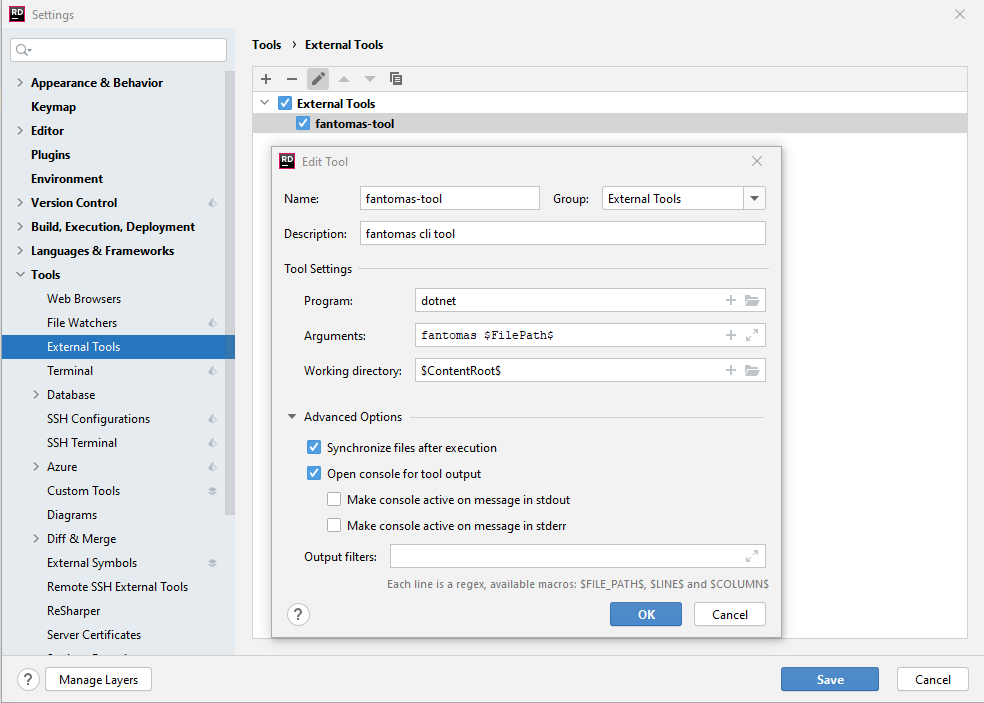

Fantomas
========


F# source code formatter, inspired by [scalariform](https://github.com/mdr/scalariform) for Scala, [ocp-indent](https://github.com/OCamlPro/ocp-indent) for OCaml and [PythonTidy](https://github.com/acdha/PythonTidy) for Python.

[](https://github.com/fsprojects/fantomas/actions)
[](https://ci.appveyor.com/project/nojaf/fantomas) [](https://gitter.im/fsprojects/fantomas?utm_source=badge&utm_medium=badge&utm_campaign=pr-badge&utm_content=badge)

## How to use

### Command line tool / API
Use this command to install Fantomas as a .NET 5 SDK global tool:

```
dotnet tool install -g fantomas-tool
```

For detailed guidelines, please read [Fantomas: How to use](docs/Documentation.md#using-the-command-line-tool).

### FAKE build system
Fantomas can be easily integrated with FAKE build system.<br />
Check out the [sample](https://github.com/fsprojects/fantomas/blob/master/fake-sample/README.md).

### JetBrains Rider

The [resharper-fsharp](https://github.com/JetBrains/resharper-fsharp) uses fantomas under the hood to format the source code. No need for any additional plugins.

#### Using the latest version inside Rider

For technical reasons Rider cannot always use the latest version of Fantomas found on NuGet.
As a workaround you could install [fantomas-tool](https://www.nuget.org/packages/fantomas-tool) locally with `dotnet tool install fantomas-tool` and configure it as an [External tool](https://www.jetbrains.com/help/rider/Settings_Tools_External_Tools.html).




**This will have an impact on your editing experiencing in Rider**, the external change to the file by the command line application might trigger more internal logic inside Rider than necessary.
It could be noticeable in regards to the default formatting experience.

### Visual Studio Code

The recommended way to use Fantomas is by using the [Ionide plugin](http://ionide.io/). Fantomas is integrated in [FSAutoComplete](https://github.com/fsharp/FsAutoComplete/) which is the language server used by Ionide.

Alternatively, you can install the [fantomas-fmt](https://marketplace.visualstudio.com/items?itemName=paolodellepiane.fantomas-fmt) extension.

### Visual Studio

The [F# Formatting](https://marketplace.visualstudio.com/items?itemName=asti.fantomas-vs) extension sets up Fantomas as the default formatter for F# files, configurable from Visual Studio's options.

### Online

Try the Fantomas [online](https://fsprojects.github.io/fantomas-tools/#/fantomas/preview).

## Early builds

Every once in a while an `alpha` or `beta` version is published to https://www.nuget.org/.
Our previous MyGet feed is now deprecated.

## Benchmarks

Some figures can be found at https://fsprojects.github.io/fantomas/ <br/>
We use [BenchmarkDotNet](https://github.com/dotnet/BenchmarkDotNet) to collect data for each build on the master branch.

## Purpose
This project aims at formatting F# source files based on a given configuration.
Fantomas will ensure correct indentation and consistent spacing between elements in the source files.
We assume that the source files are *parsable by F# compiler* before feeding into the tool.
Fantomas follows the formatting guideline being described in [A comprehensive guide to F# Formatting Conventions](docs/FormattingConventions.md).

## Use cases
The project is developed with the following use cases in mind:

 - Reformatting an unfamiliar code base. It gives readability when you are not the one originally writing the code.
To illustrate, the following example

	```fsharp
	type Type
	    = TyLam of Type * Type
	    | TyVar of string
	    | TyCon of string * Type list
	    with override this.ToString () =
	            match this with
	            | TyLam (t1, t2) -> sprintf "(%s -> %s)" (t1.ToString()) (t2.ToString())
	            | TyVar a -> a
	            | TyCon (s, ts) -> s
	```
	will be rewritten to

	```fsharp
	type Type =
	    | TyLam of Type * Type
	    | TyVar of string
	    | TyCon of string * Type list
	    override this.ToString() =
	        match this with
	        | TyLam(t1, t2) -> sprintf "(%s -> %s)" (t1.ToString()) (t2.ToString())
	        | TyVar a -> a
	        | TyCon(s, ts) -> s
	```

 - Converting from verbose syntax to light syntax.
Feeding a source file in verbose mode, Fantomas will format it appropriately in light mode.
This might be helpful for code generation since generating verbose source files is much easier.
For example, this code fragment

	```fsharp
	let Multiple9x9 () =
	    for i in 1 .. 9 do
	        printf "\n";
	        for j in 1 .. 9 do
	            let k = i * j in
	            printf "%d x %d = %2d " i j k;
	        done;
	    done;;
	Multiple9x9 ();;
	```
	is reformulated to

	```fsharp
	let Multiple9x9() =
	    for i in 1..9 do
	        printf "\n"
	        for j in 1..9 do
	            let k = i * j
	            printf "%d x %d = %2d " i j k

	Multiple9x9()
	```

 - Formatting F# signatures, especially those generated by F# compiler and F# Interactive.

For more complex examples, please take a look at F# outputs of [20 language shootout programs](tests/languageshootout_output) and [10 CodeReview.SE source files](tests/stackexchange_output).

## Why the name "Fantomas"?
There are a few reasons to choose the name as such.
First, it starts with an "F" just like many other F# projects.
Second, Fantomas is my favourite character in the literature.
Finally, Fantomas has the same Greek root as "[phantom](https://en.wiktionary.org/wiki/phantom)"; coincidentally F# ASTs and formatting rules are so *mysterious* to be handled correctly.

## Contributing Guidelines

See the [Contribution Guidelines](./CONTRIBUTING.md).

## Credits
We would like to gratefully thank the following persons for their contributions.
 - [Eric Taucher](https://github.com/EricGT)
 - [Steffen Forkmann](https://github.com/forki)
 - [Jack Pappas](https://github.com/jack-pappas)
 - [Ivan Towlson](https://github.com/itowlson)
 - [Don Syme](https://github.com/dsyme)
 - [Gustavo Guerra](https://github.com/ovatsus)
 - [Jared Parsons](https://github.com/jaredpar)
 - [Denis Ok](https://github.com/OkayX6)
 - [Enrico Sada](https://github.com/enricosada)

## License
The library and tool are available under Apache 2.0 license.
For more information see the [License file](LICENSE.md).
