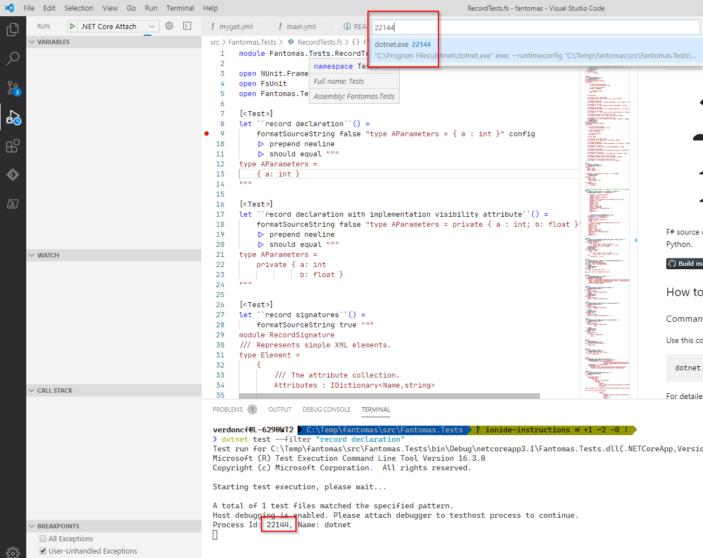
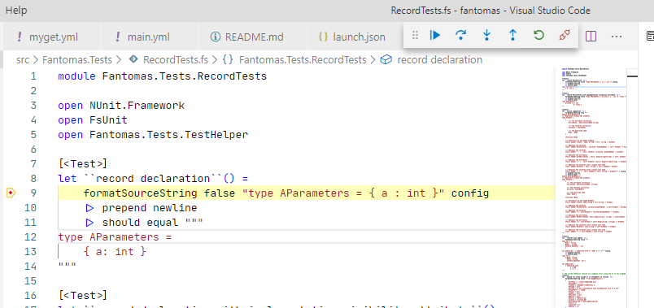

Fantomas
========


F# source code formatter, inspired by [scalariform](https://github.com/mdr/scalariform) for Scala, [ocp-indent](https://github.com/OCamlPro/ocp-indent) for OCaml and [PythonTidy](https://github.com/acdha/PythonTidy) for Python.

[](https://github.com/fsprojects/fantomas/actions)
[](https://ci.appveyor.com/project/nojaf/fantomas) [](https://gitter.im/fsprojects/fantomas?utm_source=badge&utm_medium=badge&utm_campaign=pr-badge&utm_content=badge)

## How to use

### Command line tool / API
Use this command to install Fantomas as a dotnet SDK global tool:

```
dotnet tool install -g fantomas-tool
```

For detailed guidelines, please read [Fantomas: How to use](docs/Documentation.md#using-the-command-line-tool).

### FAKE build system
Fantomas can be easily integrated with FAKE build system. Here is a sample `build.fsx`:

```fsharp
#r "paket:
nuget Fantomas 3.1.0
nuget Fake.Core.Target //"
#load "./.fake/script.fsx/intellisense.fsx"

open Fake.Core
open Fake.IO.Globbing.Operators
open Fantomas.FakeHelpers
open Fantomas.FormatConfig

let fantomasConfig = { FormatConfig.Default with PageWidth = 140 }

Target.create "CheckCodeFormat" (fun _ ->
    !!"*.fs"
    |> checkCode fantomasConfig
    |> Async.RunSynchronously)

Target.create "Format" (fun _ ->
    !!"*.fs"
    |> formatCode fantomasConfig
    |> Async.RunSynchronously
    |> printfn "Formatted files: %A")

Target.runOrList()
```

Or check out the [sample](https://github.com/fsprojects/fantomas/blob/master/fake-sample/README.md).

### JetBrains Rider

The [fsharp-support](https://github.com/JetBrains/fsharp-support) uses fantomas under the hood to format the source code. No need for any additional plugins.

### Visual Studio Code

The recommended way to use Fantomas is by using the [Ionide plugin](http://ionide.io/). Fantomas is integrated in [FSAutoComplete](https://github.com/fsharp/FsAutoComplete/) which is the language server used by Ionide.

Alternatively, you can install the [fantomas-fmt](https://marketplace.visualstudio.com/items?itemName=paolodellepiane.fantomas-fmt) extension.

### Visual Studio

The [F# Formatting](https://marketplace.visualstudio.com/items?itemName=asti.fantomas-vs) extension sets up Fantomas as the default formatter for F# files, configurable from Visual Studio's options.

### Online

Try the Fantomas [online](https://fsprojects.github.io/fantomas-tools/#/fantomas/preview).

## Early builds

We have our [own NuGet feed](https://www.myget.org/feed/fantomas/package/nuget/fantomas-tool) that contains artifacts built on the latest master branch.
To install you probably need to uninstall the current version from the official NuGet feed.

> `dotnet tool uninstall -g fantomas-tool`

Install from MyGet:

> `dotnet tool install -g fantomas-tool --add-source https://www.myget.org/F/fantomas/api/v3/index.json --framework netcoreapp3.1 --version 3.0.1-alpha-*`

Note that the `--version` is important, check the latest version [at MyGet](https://www.myget.org/feed/fantomas/package/nuget/fantomas-tool).
Your can check your current version with `fantomas --version` (since December 2018).

## Benchmarks

Some figures can be found at https://fsprojects.github.io/fantomas/ <br/>
We use [BenchmarkDotNet](https://github.com/dotnet/BenchmarkDotNet) to collect data for each build on the master branch.

## Purpose
This project aims at formatting F# source files based on a given configuration.
Fantomas will ensure correct indentation and consistent spacing between elements in the source files.
We assume that the source files are *parsable by F# compiler* before feeding into the tool.
Fantomas follows the formatting guideline being described in [A comprehensive guide to F# Formatting Conventions](docs/FormattingConventions.md).

## Use cases
The project is developed with the following use cases in mind:

 - Reformatting an unfamiliar code base. It gives readability when you are not the one originally writing the code.
To illustrate, the following example

	```fsharp
	type Type
	    = TyLam of Type * Type
	    | TyVar of string
	    | TyCon of string * Type list
	    with override this.ToString () =
	            match this with
	            | TyLam (t1, t2) -> sprintf "(%s -> %s)" (t1.ToString()) (t2.ToString())
	            | TyVar a -> a
	            | TyCon (s, ts) -> s
	```
	will be rewritten to

	```fsharp
	type Type =
	    | TyLam of Type * Type
	    | TyVar of string
	    | TyCon of string * Type list
	    override this.ToString() =
	        match this with
	        | TyLam(t1, t2) -> sprintf "(%s -> %s)" (t1.ToString()) (t2.ToString())
	        | TyVar a -> a
	        | TyCon(s, ts) -> s
	```

 - Converting from verbose syntax to light syntax.
Feeding a source file in verbose mode, Fantomas will format it appropriately in light mode.
This might be helpful for code generation since generating verbose source files is much easier.
For example, this code fragment

	```fsharp
	let Multiple9x9 () =
	    for i in 1 .. 9 do
	        printf "\n";
	        for j in 1 .. 9 do
	            let k = i * j in
	            printf "%d x %d = %2d " i j k;
	        done;
	    done;;
	Multiple9x9 ();;
	```
	is reformulated to

	```fsharp
	let Multiple9x9() =
	    for i in 1..9 do
	        printf "\n"
	        for j in 1..9 do
	            let k = i * j
	            printf "%d x %d = %2d " i j k

	Multiple9x9()
	```

 - Formatting F# signatures, especially those generated by F# compiler and F# Interactive.

For more complex examples, please take a look at F# outputs of [20 language shootout programs](tests/languageshootout_output) and [10 CodeReview.SE source files](tests/stackexchange_output).

## Installation
The code base is written in F# 4.X /.NET standard 2.0.
The solution file can be opened in Visual Studio 2017, VS Code (with the [ionide plugin](http://ionide.io/)) & [Jetbrains Rider](http://jetbrains.com/rider/).
Paket is used to manage external packages.
The [test project](src/Fantomas.Tests) depends on FsUnit and NUnit.
However, the [library project](src/Fantomas) and [command line interface](src/Fantomas.Cmd) have no dependency on external packages.

### Step to build the repo

- Install local tools: `dotnet tool restore`
- Restore .NET packages: `dotnet paket restore`
- Run build: `dotnet fake run build.fsx`

## Testing and validation
We have tried to be careful in testing the project.
There are 444 unit tests and 30 validated test examples,
but it seems some corner cases of the language haven't been covered.
Feel free to suggests tests if they haven't been handled correctly.

## Why the name "Fantomas"?
There are a few reasons to choose the name as such.
First, it starts with an "F" just like many other F# projects.
Second, Fantomas is my favourite character in the literature.
Finally, Fantomas has the same Greek root as "[phantom](https://en.wiktionary.org/wiki/phantom)"; coincidentally F# ASTs and formatting rules are so *mysterious* to be handled correctly.

## Contributing guide

Thank you for your interest in contributing to Fantomas! This guide explains everything you'll need to know to get started.

### Before touching the code
- Open an issue to propose the change you have in mind. 
- For bugs, please create them using the [online tool](https://fsprojects.github.io/fantomas-tools/). Update the title of the issue with something meaningful instead of `Bug report from fantomas-ui`.
- For stylistic changes, please take the time to discuss them and consider all possible outcomes of the change. Consult the [fsharp style guide](https://docs.microsoft.com/en-us/dotnet/fsharp/style-guide/) for guidance.
New behavior should most likely be optional because a configuration flag. 
Always keep the following train of thought: if a user upgrades Fantomas to a new version, the result of formatting with the default settings should not change.
- For new features, the same things apply: please discuss before making a PR.  

### PR checklist
- [ ] Did you cover all new code changes with unit tests? Unit tests are extremely important for this project. 
When we upgrade the [FSharp.Compiler.Service](https://www.nuget.org/packages/FSharp.Compiler.Service/) they are the only thing that tell us if all the existing behavior still works.
- [ ] When writing test also consider minor variations:
    - [ ] are `*.fsi` files impacted?
    - [ ] does this work in nested scenarios?
    - [ ] would strict mode enabled have an impact?
    - [ ] multiple code paths in case of defines? (`#if DEBUG`, ...)

### Conventions

- Unit test names should start with a lowercase letter unless the first word is a name of any sort.
- When creating a test that is linked to a GitHub issue, add the number at the back with a comma
f.ex.
```fsharp
[<Test>]
let ``preserve compile directive between piped functions, 512`` () = ...
```

### Tools

- F# AST Viewer: https://jindraivanek.gitlab.io/ast-viewer/
- F# Tokens: https://nojaf.github.io/fsharp-tokens/
- Fantomas Online: https://jindraivanek.gitlab.io/fantomas-ui/
- Trivia viewer: https://nojaf.github.io/trivia-tool/

### Upgrading FSharp.Compiler.Service

When upgrading the [FSharp.Compiler.Service](https://www.nuget.org/packages/FSharp.Compiler.Service/) please consider the following order:

- Make sure [the latest documentation](https://fsharp.github.io/FSharp.Compiler.Service/reference/fsharp-compiler-ast.html) is available.
- Update Fantomas (this repository, part 1): Update the dependency, correct any compilation errors and update [AstTransformer](src\Fantomas\AstTransformer.fs) if needed.
- Update [Fantomas Tools, group Server](https://github.com/fsprojects/fantomas-tools)
- Update Fantomas (this repository, part 2): Create issues with [Fantomas Online](https://fsprojects.github.io/fantomas-tools/#/fantomas/preview) that cover new syntax.
- After a release on NuGet, update [Fantomas Tools, group Latest](https://github.com/fsprojects/fantomas-tools)

This doesn't mean that one person should do all the work ;)

### Architectural notes
Fantomas' features are basically two commands: *format a document* or *format a selection* in the document.

They both consist of these stages:

- determine the combinations of code paths by checking the defines found in the source code.
- for each code path:
    - parse the code and generate the F# AST (Abstract Syntax Tree). This is provided by the
by the FSharp.Compiler.Services library (see the `parse` function in
[CodeFormatterImpl.fs](src/Fantomas/CodeFormatterImpl.fs)).
    - parse the code for trivia items by checking the F# tokens (`Trivia.collectTrivia`). Trivia items are additional information like newlines, comments and keywords which are not part of the F# AST. 
    Trivia items are linked to AST nodes and stored in the context.
    - rewrite the code based on the AST, trivia and formatting settings.
- merge the printed code of all code paths back to a single file/fragment.

The following sections describe the modules/function you will most likely be
interested in looking at to get started.

#### The test project: Fantomas.Tests
The organization is really simple. For each F# language feature/constructs,
there is a `[Feature]Test.fs` file. Examples:
 - *StringTests.fs*
 - *UnionTests.fs*
 - ...

Most of the tests are really simple and have this simple algorithm:
_assert that **format \[F# CODE\]** is equal to **\[FORMATTED F# CODE\]**_.

Example (from *UnionTests.fs*):
```fsharp
[<Test>]
let ``discriminated unions declaration``() =
    formatSourceString false "type X = private | A of AParameters | B" config
    |> prepend newline
    |> should equal """
type X =
    private
    | A of AParameters
    | B
"""
```

#### The `CodePrinter.genParsedInput` function: rewrites formatted code
`CodePrinter.genParsedInput` (see [CodePrinter.fs](src/Fantomas/CodePrinter.fs)): what it
basically does is traversing the AST corresponding to the code to format, and
rewriting it according to the provided formatting options.

#### The `FormatConfig` type: format settings
Settings such as :
 - indent values in spaces
 - maximum page width
 - ...

See [CodePrinter.fs](src/Fantomas/CodePrinter.fs).

### How to play with Fantomas on F# Interactive
The [CodeFormatter.fsx](src/Fantomas/CodeFormatter.fsx) script file
allows you to test the code formatting behavior. See the function `formatSrc: string -> unit`
that formats the string in input and prints it.

### Video series

There is a [YouTube video series](https://www.youtube.com/playlist?list=PLvw_J2kfZCX3Mf6tEbIPZXbzJOD1VGl4K) on how Fantomas internally works.

### Ionide

When you want to contribute to this project in VSCode with Ionide, there  is a trick you need to know to debug Unit tests.

After checking out the repository, open a terminal and set the `VSTEST_HOST_DEBUG` environment variable to `1`.

In PowerShell:

> $env:VSTEST_HOST_DEBUG=1

or in Bash:

> VSTEST_HOST_DEBUG=1

Run a single unit test with `dotnet test --filter`.

> cd .\src\Fantomas.Tests\
> dotnet test --filter "record declaration"

The output looks like:

```
Test run for C:\Temp\fantomas\src\Fantomas.Tests\bin\Debug\netcoreapp3.1\Fantomas.Tests.dll(.NETCoreApp,Version=v3.1)
Microsoft (R) Test Execution Command Line Tool Version 16.3.0
Copyright (c) Microsoft Corporation.  All rights reserved.

Starting test execution, please wait...

A total of 1 test files matched the specified pattern.
Host debugging is enabled. Please attach debugger to testhost process to continue.
Process Id: 20312, Name: dotnet
```

And we can now attach to the unit testing process.




**Press the play button once the process has been chosen!**
This might be a bit strange but you need to press play in order for the debugger to start working.



Check out this [video fragment](https://youtu.be/axHIazqiO9E?t=65) to see this in action.

## Credits
We would like to gratefully thank the following persons for their contributions.
 - [Eric Taucher](https://github.com/EricGT)
 - [Steffen Forkmann](https://github.com/forki)
 - [Jack Pappas](https://github.com/jack-pappas)
 - [Ivan Towlson](https://github.com/itowlson)
 - [Don Syme](https://github.com/dsyme)
 - [Gustavo Guerra](https://github.com/ovatsus)
 - [Jared Parsons](https://github.com/jaredpar)
 - [Denis Ok](https://github.com/OkayX6)
 - [Enrico Sada](https://github.com/enricosada)

## License
The library and tool are available under Apache 2.0 license.
For more information see the [License file](LICENSE.md).
