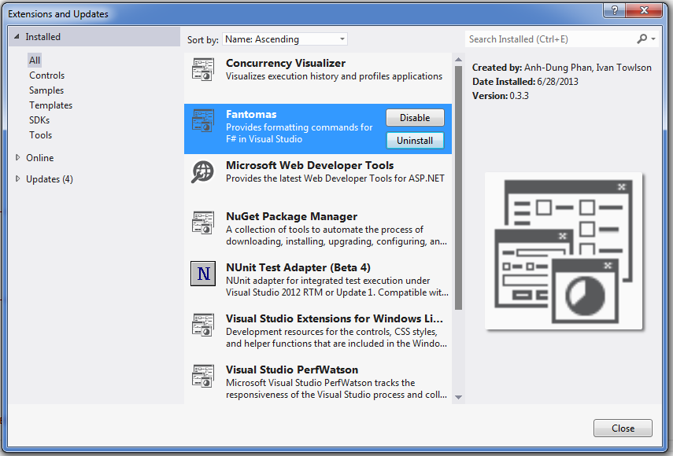
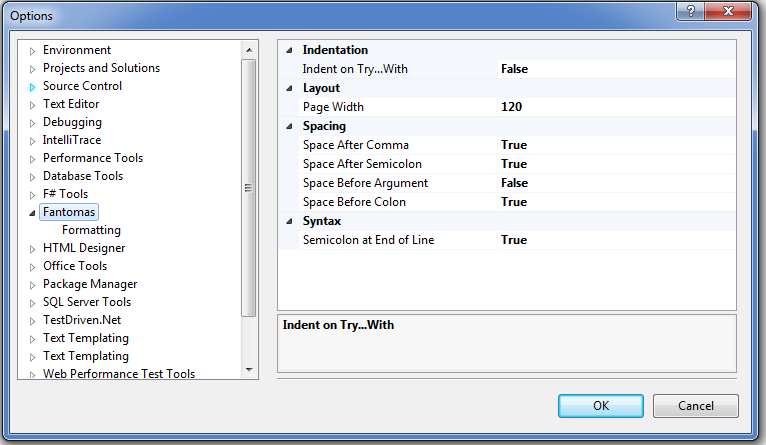

## Fantomas: How to use

### Using Visual Studio 2012 extension
---

After being installed, Fantomas extension will appear under `Tools -> Extensions and Updates` menu. You can uninstall, disable or re-install the extension there.

-><-

The main formatting options are under `Tools -> Options -> Fantomas`. 

-><-

To be consistent with Visual Studio editors, the last option, *indent size*, can be adjusted under `Tools -> Options -> Text Editor -> Indent size` option.

Two main functionalities of the extension are:
 
 - *Formatting Document*, available under **Ctrl + K D** key combination.
 - *Formatting Selection*, available under **Ctrl + K F** key combination.

**N.B:**

Due to technical restrictions, formatting selection feature is only guaranteed to work for:

 - modules
 - types
 - member declarations
 - let bindings
 - expressions
 - and any combination thereof.

Any *unparsable* selection will not get meaningful results.

### Using the command line tool
---

For the overview how to use the tool, you can type the command

	Fantomas --help

You have to specify an input path and optionally an output path. 
The output path is prompted by `--out` e.g.

	Fantomas ../../../../tests/stackexchange/array.fs --out ../../../../tests/stackexchange_output/array.fs 

Both paths have to be files or folders at the same time. 
If they are folders, the structure of input folder will be reflected in the output one. 
The tool will explore the input folder recursively if you set `--recurse` option (see [Options section](#options)).
If you omit the output path, Fantomas will overwrite the input files.


#### Options
 - `--recurse`: traverse the input folder recursively (if it is really a folder) to get all F# source files.
 - `--force`: force writing original contents to output files. 
This is helpful if the tool fails on some unknown F# constructs.
 - `--stdin`: read input from standard input. This option is convenient to use with piping
 
        type input.fs | Fantomas --stdin --out output.fs
 
 - `--stdout`: write formatted source code to standard output e.g.
 
        Fantomas input.fs --stdout

 - `--fsi`: this option to be used with `--stdin` to specify that we are formatting F# signatures e.g.

        type input.fsi | Fantomas --fsi --stdin --stdout

#### Preferences
 - `--indent <number>`: `number` has to be between 1 and 10. 
This preference sets the indentation (default = 4). 
The common values are 2 and 4. 
The same indentation is ensured to be consistent in a source file. 
To illustrate, here is a code fragment with `--indent 2`:
 
	```fsharp
	let inline selectRandom(f : _[]) = 
	  let r = random 1.0
	  let rec find = 
	    function 
	    | 0 -> fst f.[0]
	    | n when r < snd f.[n] -> fst f.[n]
	    | n -> find(n - 1)
	  find <| f.Length - 1
	```
 - `--pageWidth <number>`: `number` has to be an integer greater or equal to 60.
This preference sets the column where we break F# constructs into new lines.
The default value is 80. To see its effects, please take a look at some [output files](tests/stackexchange_output) with `--pageWidth 90` preference.

 - `--noSemicolonEOL`: remove all semicolons at the end of lines e.g.

	```fsharp
	let saturn = 
	  { X = 8.343366718;
	    Y = 4.124798564;
	    Z = -0.4035234171;
	    VX = -0.002767425107 * daysPerYear;
	    VY = 0.004998528012 * daysPerYear;
	    VZ = 2.304172976e-05 * daysPerYear;
	    Mass = 0.0002858859807 * solarMass }
	```
	
	vs.
	
	```fsharp
	let saturn = 
	  { X = 8.343366718
	    Y = 4.124798564
	    Z = -0.4035234171
	    VX = -0.002767425107 * daysPerYear
	    VY = 0.004998528012 * daysPerYear
	    VZ = 2.304172976e-05 * daysPerYear
	    Mass = 0.0002858859807 * solarMass }
	```

 - `--spaceBeforeArgument`: if being set, a space is inserted before a function name and its first argument. 
For example, `Console.WriteLine("Hello World")` becomes `Console.WriteLine ("Hello World")`.

 - `--noSpaceBeforeColon`: if being set, there is no space before `:` e.g.

	```fsharp
	type Planet = 
	  { mutable X : float
	    mutable Y : float
	    mutable Z : float
	    mutable VX : float
	    mutable VY : float
	    mutable VZ : float
	    Mass : float }
	```
	
	vs.
	
	```fsharp
	type Planet = 
	  { mutable X: float
	    mutable Y: float
	    mutable Z: float
	    mutable VX: float
	    mutable VY: float
	    mutable VZ: float
	    Mass: float }
	```
 - `--noSpaceAfterComma`: it is useful if you would like to save spaces in tuples, arguments, etc. 
To illustrate, `(1, 2, 3)` is rewritten to `(1,2,3)`.
 
 - `--noSpaceAfterSemiColon`: it saves spaces on records, arrays, lists, etc. Now 

	```fsharp
	let planets = [|sun; jupiter; saturn; uranus; neptune|]
	```

	becomes

	```fsharp
	let planets = [|sun;jupiter;saturn;uranus;neptune|]
	```

 - `--indentOnTryWith`: if being set, `with` blocks will be indented like in the following example:

	```fsharp
	try
	    if System.DateTime.Now.Second % 3 = 0 
		then raise(new System.Exception())
	    else raise(new System.ApplicationException())
	with
	    | :? System.ApplicationException -> 
	        printfn "A second that was not a multiple of 3"    
	    | _ -> 
	        printfn "A second that was a multiple of 3"
	```

That said, most of the preferences are very simple. 
But they demonstrate the adaptiveness of Fantomas on a set of configurations. 
More preferences will be added depending on use cases.

### Using the API
---
The main entry point of the library is function `processSourceFile` which reads the input file and writes formatted source code to a text writer:

```fsharp
val processSourceFile : inFile:string -> tw:TextWriter -> config:FormatConfig -> unit
```

`FormatConfig` type consists of the fields described in [Preferences section](#preferences). 
It's often customized by augmenting a default configuration:

```fsharp
let config = { FormatConfig.Default with 
                IndentSpaceNum = 2
				PageWidth = 120
                SemicolonAtEndOfLine = false
                SpaceBeforeArgument = false 
                SpaceBeforeColon = false
                SpaceAfterComma = true
                SpaceAfterSemicolon = true
                IndentOnTryWith = true }
```

If you would like to work with source strings, there is also function `formatSourceString`:

```fsharp
val formatSourceString : fsi:bool -> s:string -> config:FormatConfig -> string
```

When the first argument is true, the source string is parsed as an F# signature.

There is a function for formatting a selected text

```fsharp
val formatSelectionFromString : fsi:bool -> r:range -> s:string -> config:FormatConfig -> string
```

where range `r` denoting the selection is often constructed from 

```fsharp
val makeRange : startLine:int -> startCol:int -> endLine:int -> endCol:int -> range
```

Note that Fantomas will expand the selection until it finds boundaries of start and end tokens. *Only parsable selection (types, members, let bindings, expressions, etc) can be formatted*. The pre- and post- texts of the selection will be kept as is.
