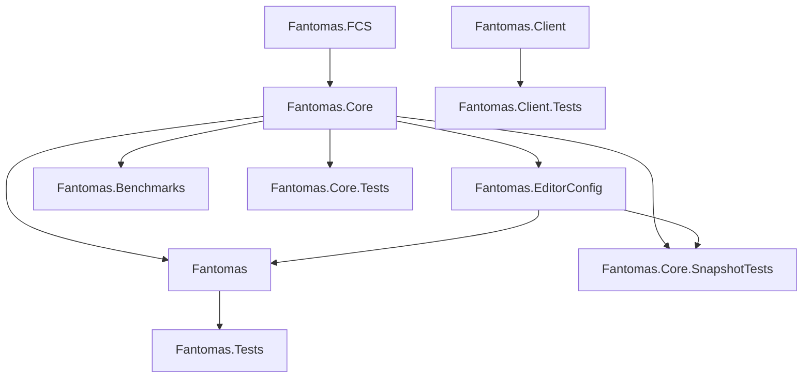

# Solution structure

Fantomas has a modular project structure.  
The parser (`Fantomas.FCS`), the core library (`Fantomas.Core`) and the command line application (`fantomas`) are the main components of the solution.

## Fantomas.FCS

This is a very custom fork of the F# compiler. We only expose a single parse function to construct the untyped syntax tree.
We achieve this by taking the files necessary to compile the F# parser from source (via custom code in a `Fun.Build` pipeline).
This limits the dependency footprint that our compiler has, compared to the official [F# compiler NuGet package](https://www.nuget.org/packages/FSharp.Compiler.Service).

Note that the AST returned by `Fantomas.FCS` looks identical to what the official F# compiler returns.
However, the AST is not binary compatible. It is most likely that Fantomas contains a newer version of the Syntax tree than the official F# compiler.

## Fantomas.Core

The heart of Fantomas is the core library. It contains the core logic reconstructing source code from the AST.
Fantomas can be used as a library, see `CodeFormatter.fsi` to learn what APIs are exposed.

## Fantomas

The command line application is the main entry point of the solution.  
It exposes the core functionality and also takes care of `.editorconfig` and `.fantomasignore` files.

## Fantomas.EditorConfig

Reading Fantomas's settings from `.editorconfig` properties, and writing them back. It is a project of
its own so that the snapshot cases read their settings with the same code as the tool. It is not
a package: it ships inside the `fantomas` tool. Finding the `.editorconfig` files that apply to a
file stays in `Fantomas`.

## Fantomas.Benchmarks

A [BenchmarkDotNet](https://benchmarkdotnet.org/articles/overview.html) project used to measure the performance of the core library.
We format a fixed revision of `CodePrinter.fs` as part of our CI process, to detect potential regressions.

## Fantomas.Client

A standalone library project that editors can use to interact with the `fantomas` commandline application.
Editors do not use `Fantomas.Core`, instead they use the `Fantomas.Client` library to connect to a `fantomas` dotnet tool.
This allows end-users to bring their "own version" of Fantomas.
This selected version could then later be re-used to verify if all files were formatted in a CI scenario.

## Fantomas.Core.SnapshotTests

The formatting tests of `Fantomas.Core`, as files: every input under `cases/` sits beside the result
formatting gives for it. Its README says how to write a case.

## Fantomas.Core.Tests

Unit tests of the internals of `Fantomas.Core`, and of what a snapshot case cannot show, such as
formatting a syntax tree without its source.

## Fantomas.Tests

A suite of end-to-end tests that run the actual `fantomas` command line application.

## Fantomas.Client.Tests

A suite of end-to-end tests that will verify the `Fantomas.Client` code against released versions of `fantomas`.

<fantomas-nav source="docs/contributors/Solution Structure.md" previous="Getting%20Started.md" next="Transforming.md"></fantomas-nav>