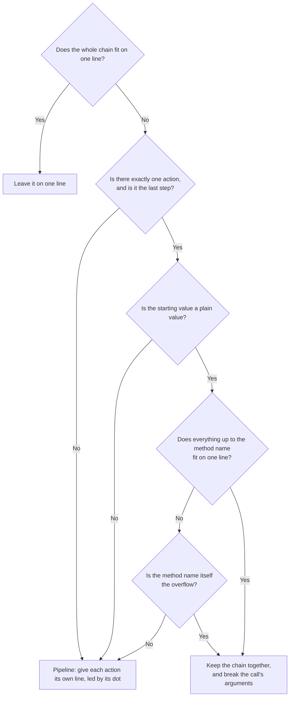

# Chains

A _chain_ is a starting value followed by a series of steps, where every step is reached through a dot:

```fsharp
document.Body.FirstChild.AppendChild(newNode)
```

Here `document` is the starting value, and `.Body`, `.FirstChild` and `.AppendChild(newNode)` are the steps.

Chains are one of the few shapes where Fantomas has a real choice to make about line breaks.
This page states the rules it follows and the reasoning behind each one, in plain language and without reference to any internal types.

Every code block on this page is Fantomas output, except where marked ⛔.
A ⛔ block is the alternative that was considered and turned down, shown so that the reasoning is visible rather than implied, and ✅ marks what Fantomas does instead.
The two markers appear wherever there was a real choice to make; elsewhere the output speaks for itself and goes unmarked.

## Status: a proposal, backed by an implementation

The [F# style guide](https://learn.microsoft.com/en-us/dotnet/fsharp/style-guide/formatting) currently says very little about how to lay out a long chain.
The rules described here are meant to fill that gap and to eventually become part of that guide.
This page lives under Contributors for that reason: until the rules are officially adopted, they are a proposal we are testing, not settled guidance to hand to end-users.

As noted in the [Fantomas style guide page](../end-users/StyleGuide.html), the style itself is not decided in the Fantomas repository.
Those conversations happen at [fsharp/fslang-design](https://github.com/fsharp/fslang-design#style-guide), and they go much better when there is something concrete to react to.
A written proposal invites arguments about hypothetical snippets.
A proposal that is already implemented lets everyone run it over a real code base and see what it does to code they care about.

That is the order of work here: implement the rules in Fantomas first, use the implementation to find the awkward cases and settle them, then pitch the result upstream.
So treat this page as the current best answer rather than a settled one.
If you disagree with a rule, the discussion belongs at [fsharp/fslang-design](https://github.com/fsharp/fslang-design#style-guide), and having the implementation in hand is exactly what makes that discussion productive.

## A reminder of how Fantomas works

Fantomas does not edit your text.
Think of it like a word processor: it re-types your entire file from scratch, following its own rules.

Most of that re-typing is mechanical: spacing, indentation and parentheses follow fixed rules with nothing to decide.
The one real choice is **where to put line breaks**, and it comes down to a single question:

> Does this fit within the max line length?

If the answer is yes, it stays on one line and there is nothing more to decide.
Everything below is about what happens when the answer is **no**.

One thing overrides the fit question: trivia the user wrote between the steps.
A trailing comment on the starting value, or an `#if` directive in front of a step, pins that step to its own line no matter how much room is left.

```fsharp
// ✅ at a max line length of 80 this fits on one line, and is still broken up
config // note
    .Settings.GetValue(theKeyName)
```

## What counts as a chain

The dot is what matters. If there is no dot, there is no step:

```fsharp
xs[i]           // not a chain, there is no dot
f (args)        // not a chain, there is no dot
arr.[i]         // a chain, this indexing syntax does have a dot
```

An expression without any dots is laid out by other rules, not the ones on this page.

## Two decisions, not one

Formatting a chain settles two questions that have nothing to do with each other:

1. **Where do the line breaks go?** A style decision, and the bulk of this page.
2. **May a space sit between a method name and its `(`?** Mostly _not_ a style decision, and the shorter of the two, so it is settled first.

## Only the last call may have a space before its parentheses

Fantomas has settings that ask for a space before the parentheses of a call, [`space_before_uppercase_invocation`](../end-users/Configuration.html) and [`space_before_lowercase_invocation`](../end-users/Configuration.html).

In a chain, **those settings apply to the final call only**. Every earlier call stays tight, whatever the settings say:

```fsharp
// both examples with space_before_uppercase_invocation = true

obj.Bar ()          // a call on its own: the setting applies

a.Foo(x).Bar (y)    // in a chain: only the final .Bar takes the space,
                    // the intermediate .Foo stays tight
```

This is not Fantomas being inconsistent. A space in the middle of a chain changes what the code _means_:

```fsharp
// ⛔ parsed as a.Foo ((x).Bar()) — a different program
a.Foo (x).Bar()

// ✅ parsed the way you intended
a.Foo(x).Bar()
```

The parser reads `(x).Bar()` as a single parenthesised argument handed to `a.Foo`. So for every call except the last one, tightness is a grammar requirement rather than a preference, and no setting can override it.

The same constraint turns up wherever an expression has to stay glued to its neighbour. In `getBuilder().Build()` the starting value keeps its own `()` tight, in `x.Foo()[0]` the indexed call keeps its own `()` tight, and the dynamic-access operator `?` behaves the same way: `settings?Section("db")?ConnectionString` stays tight throughout. In each case a space there would rebind the parentheses to the wrong thing. (The _final_ call is still free to take a space: with the setting on, that first example formats as `getBuilder().Build ()`.)

### The `_.` shorthand lambda

There is one place where even the last call stays tight.
F# lets you write `_.Property` as a short lambda, and Fantomas treats it as a chain whose starting value is `_`:

```fsharp
"yow" |> _.Substring(0, 16).ToLower()
```

Everywhere else the _last_ call of a chain may take a space when a setting asks for one. Here it may not: the F# compiler requires the body of a `_.` lambda to stay atomic.

```fsharp
// both with space_before_uppercase_invocation = true

// ⛔ what the setting would ask for here — this fails to compile with FS3584
"yow" |> _.Substring(0, 16).ToLower ()

// ✅ the body of a `_.` lambda stays tight regardless of the setting
"yow" |> _.Substring(0, 16).ToLower()
```

This was [issue 3364](https://github.com/fsprojects/fantomas/issues/3364).

That is the only thing that makes `_.` special, and it is a question of tightness rather than of line breaks.
Everything from here on applies to it exactly as to any other chain. The example above has two calls, so if it does not fit it becomes a pipeline:

```fsharp
_
    .Substring(0, 16)
    .ToLower()
```

Everything from here on is about the first question, where the line breaks go.

## Two kinds of step

Once Fantomas has to break a chain, it sorts the steps into two weights.

**Navigation** is a step that just gets you somewhere:

```fsharp
.Name           // a plain member
.[0]            // a short index
.Cast<T>        // short type arguments
```

**Action** is a step where something happens, meaning a call:

```fsharp
.Foo(x)
.Bar()
.Cast<T>()      // a generic call is still a call
```

A call is always an action, no matter how short it is.
Type arguments make no difference to this: what makes `.Cast<T>()` an action is the `()`, not the `<T>`.

That is the one pair worth keeping straight:

```fsharp
.Cast<T>        // navigation, this only names something
.Cast<T>()      // action, this calls something
```

## Working through a chain

Before the rules are stated one by one, here is the whole process applied to a single chain, at a max line length of 60.
Everything after this section is the detail behind one of these five steps.

```fsharp
// ⛔ the chain as written: 95 characters against a margin of 60
builder.Connect(hostName).Configuration.Database.PrimaryConnection.Settings.Apply(spec).Build()
```

**Step 1. Does it fit?** No: 95 characters against a margin of 60. Had it fitted, that would have been the end of it and no rule below would ever have been consulted.

**Step 2. Label every part.** The starting value, then each step as either navigation or an action:

```text
builder               starting value
  .Connect(hostName)  action        — it calls something
  .Configuration      navigation    — it only names something
  .Database           navigation
  .PrimaryConnection  navigation
  .Settings           navigation
  .Apply(spec)        action
  .Build()            action
```

**Step 3. Count the actions to pick a layout.** There are three, so this is a pipeline and every action gets a line of its own, led by its dot.
Only a chain with exactly one action, as its last step, after a plain starting value, is kept together instead.

**Step 4. Let the navigation ride.** Navigation never claims a line of its own. Each step rides at the front of the line belonging to the action it introduces, so the four navigation steps join `.Apply(spec)`:

```fsharp
// ⛔ not finished: the third line is 66 characters
builder
    .Connect(hostName)
    .Configuration.Database.PrimaryConnection.Settings.Apply(spec)
    .Build()
```

**Step 5. Is any line still too long?** The third one is. Its run of navigation wraps, balanced so that the longest line comes out as short as possible, and wrapped one step earlier than strictly necessary so that `.Apply(spec)` is not forced to break its argument:

```fsharp
// ✅ the finished layout
builder
    .Connect(hostName)
    .Configuration.Database
    .PrimaryConnection.Settings.Apply(spec)
    .Build()
```

Those five steps are the whole algorithm. To apply it to a chain of your own: check the width, label the parts, count the actions, let the navigation ride, then wrap any line that is still too long.

## Steps 1 to 3: the rule for line breaks

The rule behind the first three steps:



The questions after the first are the conditions for keeping the chain together, and a "no" to any one of them lands in the same place, bar the last one's escape hatch.

In one sentence:

> A plain `value.Method(args)` breaks its arguments, like any other call.
> As soon as there are two or more calls, the chain is a pipeline and each call gets its own line.

**Step 1 is the first question**, and for most chains it is also the last. At a max line length of 50:

```fsharp
// ✅ 32 characters, so nothing moves
config.Settings.GetValue(theKey)
```

Every example from here to the end of the page is a chain that did _not_ fit, so this question is answered "no" from now on.

**Step 3 is the second question**, and of its three conditions the first is the interesting one. The other two are guards, and each is worth a sentence.

**The starting value must be a plain value.** Lengthen the argument until the chain runs past the margin:

```fsharp
// ⛔ 65 characters at a margin of 50
config.Settings.GetValue(theConfigurationKeyNameThatIsRatherLong)
```

A bare identifier or dotted path qualifies as a plain starting value, so this chain is kept together and only the argument moves:

```fsharp
// ✅ a plain starting value: the chain is kept together
config.Settings.GetValue(
    theConfigurationKeyNameThatIsRatherLong
)
```

A call, a parenthesised expression or a generic name does not qualify. Doing the same thing to one of those would be the obvious move, since such a chain still has just one action and that action is still last:

```fsharp
// ⛔ the starting value is a call, glued to the navigation behind it
getConfiguration().Settings.GetValue(
    theConfigurationKeyNameThatIsRatherLong
)
```

Fantomas leads a pipeline instead:

```fsharp
// ✅ the starting value gets the opening line
getConfiguration()
    .Settings.GetValue(
        theConfigurationKeyNameThatIsRatherLong
    )
```

The two inputs differ only in their starting value. A compound one is already doing something, so it earns the opening line rather than serving as a prefix to the navigation behind it.

One compound starting value is exempt: a parenthesised expression whose only step is an index, with no call after it. Indexing a parenthesised value reads as a plain access rather than a pipeline, so the index rides tight onto the closing paren:

```fsharp
// ✅ at a max line length of 30, the index stays welded to the `)`
let x =
    (someVeryLongExpression
     + otherLongThing).[0]
```

**Everything up to the method name must fit on one line.** When it does not, or when a comment falls between the steps, there is nothing left to keep together and the pipeline takes over:

```fsharp
// ✅ the comment splits the steps, so there is nothing to keep together
config.Settings
    // the primary one
    .GetValue(theKeyName)
```

With one exception: when the method name alone would still overflow on a line of its own, moving it down gains nothing, so the chain stays together and the arguments wrap anyway.

```fsharp
// ✅ at a max line length of 40, `.AVeryVery...` overflows wherever you put it
config.AVeryVeryLongMethodNameThatIsCertainlyTooLong(
    arg
)
```

That second guard is also why step 5, wrapping a long run of navigation, never applies to this branch: a chain is only kept together when its navigation already fits on one line, and in the escape-hatch case the overflow is the method name, which wrapping the navigation would not fix either.

## Step 4: navigation rides along

Navigation is never worth a line of its own. It rides at the front of the line belonging to the action it introduces.

Riding along only works while the navigation itself stays on one line.
If an index (or a set of type arguments) has to break across several lines, it can no longer be a passenger, and the question above then counts it as an action: it claims a line of its own, and the chain around it becomes a pipeline.
It is still navigation in what it _does_; it has simply grown too big to ride along.

## Step 5: when a line is still too long

Steps 3 and 4 decide which steps share a line. They leave one question open, because navigation accumulates: a line they hand you can itself be too long.
So the fit question from step 1 comes round a second time, now asked of a line the rules have just produced rather than of the chain as a whole.

Here is a chain that runs into it, at a max line length of 100:

```fsharp
// ⛔ 118 characters, well past the margin, so a break has to go somewhere
getConfiguration().Configuration.Database.PrimaryConnection.Settings.Timeouts.IdleTimeout.Duration.Total.Seconds.Value
```

The rule above will not place that break. `getConfiguration()` is the starting value, every step after it is navigation, and there is no action anywhere to lead a second line.

The obvious answer is to fill greedily, packing each line up to the margin before starting a new one. That is what a text editor does to a paragraph:

```fsharp
// ⛔ greedy: one line packed to the margin, then a stub
getConfiguration()
    .Configuration.Database.PrimaryConnection.Settings.Timeouts.IdleTimeout.Duration.Total.Seconds
    .Value
```

Ninety-four characters, and then `.Value` on its own. Fantomas instead chooses the wrap that makes **the longest resulting line as short as possible**:

```fsharp
// ✅ balanced: fifty characters on each line
getConfiguration()
    .Configuration.Database.PrimaryConnection.Settings
    .Timeouts.IdleTimeout.Duration.Total.Seconds.Value
```

When two wraps tie, the longer first line wins.

The reason to prefer the second is that neither break point _means_ anything.
A run of navigation has no internal structure that makes one dot a better stopping place than another, unlike the boundary between two actions, which is a real seam in what the code does.
When the choice is arbitrary the only thing left to weigh is how easy the result is to read, and two comparable lines are easier to scan than a full one followed by a remnant.

### The starting value never sits alone

A run of navigation often begins on the same line as the starting value, which is `defineCombinationValue` in the example below.
That value is not a step, so a line holding it and nothing else has nothing on it to balance: it is a wasted line rather than a short one.
Whenever there is room beside it for the first step, it keeps that step, and the rest of the run is balanced from there.

```fsharp
// ⛔ balancing on its own: the shortest longest line, but the starting value is stranded
defineCombinationValue
    .Value.IsEmpty

// ✅ the starting value keeps a step
defineCombinationValue.Value
    .IsEmpty
```

With only two steps to place, no split avoids a short line, and stranding the starting value costs more than a short last line does.
This matters much less as a run grows: once there are several steps, the first line is full anyway and the rule never comes up.

### The wrap makes room for the arguments

When a wrapped line ends in a call, there are two ways to find the width it needs: move some navigation down, or break the call's arguments.

Balancing on width alone would take the second. The navigation stops just short of the margin, which leaves the arguments nowhere to go:

```fsharp
// ⛔ the navigation fills its line and pushes the argument below
getConfiguration()
    .Configuration.Database.PrimaryConnection.Settings.Timeouts.GetValue(
        keyName
    )
```

Moving navigation is the cheaper of the two, so Fantomas wraps one step earlier than it strictly had to, which keeps `keyName` beside the method that takes it:

```fsharp
// ✅ the navigation gives way and the call stays whole
getConfiguration()
    .Configuration.Database.PrimaryConnection
    .Settings.Timeouts.GetValue(keyName)
```

The same holds mid-pipeline, where it is an intermediate call that stays intact:

```fsharp
// ✅ `spec` is never pushed onto a line of its own
builder
    .Connect(hostName)
    .Configuration.Database
    .PrimaryConnection.Settings.Apply(spec)
    .Build()
```

When no wrap can hold the whole call, because the arguments are too wide however the navigation is arranged, only the opening `(` has to fit and the arguments break as they normally would.

None of this contradicts _Arguments are not the chain's business_ below.
The chain still never decides how the arguments are laid out; it only prefers, among its own wrap points, one that leaves the call intact.
And a call that has left the starting value's line already has a line of its own, so there is nothing for the navigation to make room for:

```fsharp
Microsoft.FSharp.Reflection.FSharpType
    .GetUnionCases(typeof<option<option<unit>>>.GetGenericTypeDefinition().MakeGenericType(t))
    .Assembly
```

### Balancing never crosses an action

Only a run of consecutive navigation steps is balanced.
Widths alone would suggest pulling the first call up onto the starting value's line, since that evens the lines out nicely:

```fsharp
// ⛔ balanced on width, but the seam between the two calls is gone
serviceCollection.AddSingleton<IClock>(systemClock)
    .AddOptions<MyOptions>(configureOptions)
```

Fantomas will not do that. An action always starts its own line, and that is a decision about what the code _does_ rather than about width, so nothing in this section can move it:

```fsharp
// ✅ one action per line, placed by the rule above
serviceCollection
    .AddSingleton<IClock>(systemClock)
    .AddOptions<MyOptions>(configureOptions)
```

The boundary between two actions is a real seam in the code. The dots inside a run of navigation are not, which is exactly why balancing is free to move those and not these.

## Examples

The examples below assume a narrower [max line length](../end-users/Configuration.html) than the default, so the breaks are visible on this page.

### One call at the end: the arguments break

```fsharp
config.GetConnectionString(
    "primary-database-readonly-replica-connection-string"
)
```

There is a single action and it is the last step, so `config.GetConnectionString(` stays together and only the argument moves.
This is exactly how an ordinary call breaks. Having a starting value in front of it changes nothing.

### Navigation in front of a single call: still just the arguments

```fsharp
response.Content.Headers.GetValues(
    "Content-Type-And-Transfer-Encoding-Header"
)
```

`.Content` and `.Headers` are navigation, so there is still only one action.
The chain is not a pipeline and the navigation stays with the starting value.

### Two or more calls: a pipeline

```fsharp
serviceCollection
    .AddSingleton<IClock>(systemClock)
    .AddOptions<MyOptions>(configureOptions)
```

Two actions, so each one gets its own line led by its dot.

### Navigation between calls rides along

```fsharp
document.Body.FirstChild
    .AppendChild(newNode)
    .ParentElement.RemoveChild(oldNode)
```

`.Body` and `.FirstChild` lead the first line.
`.ParentElement` is navigation introducing `.RemoveChild(oldNode)`, so it rides at the front of that line instead of claiming one of its own.

### An index too big to ride along

```fsharp
lookupTable.[0].AppendEntry(
    newEntryForTheBucket
)
```

A short index is navigation, so there is a single action at the end and only its arguments break.

Grow the index until it needs several lines of its own and it can no longer ride along:

```fsharp
lookupTable
    .[computeBucketIndex
        hashOfTheKeyValue
        tableSizeInBuckets]
    .AppendEntry(newEntry)
```

Nothing about the index started executing. It just stopped fitting on someone else's line.

### A chain that ends in navigation

There is only one call here, but it is **not** the last step. Breaking just its arguments would leave the navigation stranded after the closing `)`:

```fsharp
// ⛔ `.Entries.[indexWithinTheBucket]` is left dangling off the `)`
lookupTable.GetBucketForHash(
    hashOfTheKeyValue
).Entries.[indexWithinTheBucket]
```

So the pipeline layout is used instead:

```fsharp
// ✅ every step is reachable by reading down the dots
lookupTable
    .GetBucketForHash(hashOfTheKeyValue)
    .Entries.[indexWithinTheBucket]
```

### A chain with no calls at all

```fsharp
this.Configuration.Database.PrimaryConnection
    .Settings.IdleTimeoutInSeconds
```

There are no actions to lead any lines, so the whole chain is one long line of navigation and it is wrapped by the rule in [step 5](#step-5-when-a-line-is-still-too-long).

### A starting value that is itself a call

```fsharp
getConfiguredServiceBuilder()
    .AddLogging(loggingOptions)
    .Build()
```

The opening call stays glued to its `()` and acts as the starting value.
It has to stay glued: a space there would change what the code means.

This one is a pipeline on the strength of its two calls alone, but a starting value of this shape leads a pipeline even with a single call, as noted in the rule above.

## Arguments are not the chain's business

It is worth stating the boundary explicitly, because it is what keeps the rules above so short:

> The chain rules decide where lines break **between** steps.
> They say nothing about what happens **inside** a call's parentheses.

Everything between `(` and `)` is laid out by the ordinary rules for call arguments, exactly as it would be if that call had no starting value in front of it.
A chain never overrides them.
That is the same idea as "break the call's arguments" in the rule above: at that point Fantomas stops making chain decisions and hands the argument to the normal machinery.

The practical consequence is that **every setting that governs argument layout keeps working unchanged inside a chain**.
The one you are most likely to notice is [`multi_line_lambda_closing_newline`](../end-users/Configuration.html), which decides where the closing `)` lands when a lambda argument needs several lines.

With the default (`false`), the `)` trails the last line of the lambda:

```fsharp
storage.SetConfigurationSettingPublisher(fun configName publisher ->
    publish configName publisher)
```

With `true`, it drops to its own line:

```fsharp
storage.SetConfigurationSettingPublisher(fun configName publisher ->
    publish configName publisher
)
```

Because the setting belongs to the argument and not to the chain, it is honoured wherever the call sits.
Above it was the single trailing call. Here it is three calls inside a pipeline, with the same `true` setting:

```fsharp
builder
    .FirstThing<X>(fun lambda ->
        processFirst lambda
    )
    .SecondThing<Y>(fun next ->
        processSecond next
    )
    .ThirdThing<Z>()
    .Result
```

For the same reason, each call decides independently whether it needs several lines.
A long call does not drag the short ones open:

```fsharp
repo
    .Where(fun customer ->
        customer.IsActive && customer.Region = targetRegion)
    .Select(projector)
    .ToList()
```

### Match lambdas are no exception

Match lambdas, written `(function`, are the argument shape most likely to look like an exception, so it is worth showing in full that they are not one.
The F# style guide asks for them to be treated the same as `fun` lambdas ("Treat match lambda's in a similar fashion"), and they are: where the call sits in its chain makes no difference to either form.

Here are both lambda forms, in both positions, under the default settings:

```fsharp
// ✅ fun, mid-pipeline
builder
    .Configure(fun v ->
        handleSomeValue v |> andThenSomethingElse v)
    .Build()
    .Result

// ✅ fun, last step
builder
    .Build()
    .Configure(fun v ->
        handleSomeValue v |> andThenSomethingElse v)

// ✅ function, mid-pipeline
builder
    .Configure(function
        | Some v -> handleSome v
        | None -> handleNone ())
    .Build()
    .Result

// ✅ function, last step
builder
    .Build()
    .Configure(function
        | Some v -> handleSome v
        | None -> handleNone ())
```

Read down the column: each form keeps its shape when the call moves. Read across the pair: both forms keep the opener attached to the `(`.

Now the same four with `multi_line_lambda_closing_newline` set to `true`:

```fsharp
// ✅ fun, mid-pipeline
builder
    .Configure(fun v ->
        handleSomeValue v |> andThenSomethingElse v
    )
    .Build()
    .Result

// ✅ fun, last step
builder
    .Build()
    .Configure(fun v ->
        handleSomeValue v |> andThenSomethingElse v
    )

// ✅ function, mid-pipeline
builder
    .Configure(
        function
        | Some v -> handleSome v
        | None -> handleNone ()
    )
    .Build()
    .Result

// ✅ function, last step
builder
    .Build()
    .Configure(
        function
        | Some v -> handleSome v
        | None -> handleNone ()
    )
```

Position still makes no difference. What the setting changes is the closing `)`, which now takes a line of its own in all four.

The one difference left between the two forms is that `function` also moves down off the `(`, while `(fun v ->` stays put. That is not about the chain either: a `fun` lambda's parameters have to stay with their arrow, so there is nothing to move, whereas `function` takes no parameters and can. The setting simply has a visible effect on the opener as well as on the closing `)` for that one argument shape.

One further thing moves `function` down onto its own line, and it belongs to the argument rather than the chain: having broken after the `(` yourself, which Fantomas leaves as you wrote it.

The only thing the chain decides here is that the `(` never leaves `.Configure`, for the parsing reason given in [Only the last call may have a space before its parentheses](#only-the-last-call-may-have-a-space-before-its-parentheses).

<fantomas-nav previous="{{fsdocs-previous-page-link}}" next="{{fsdocs-next-page-link}}"></fantomas-nav>
