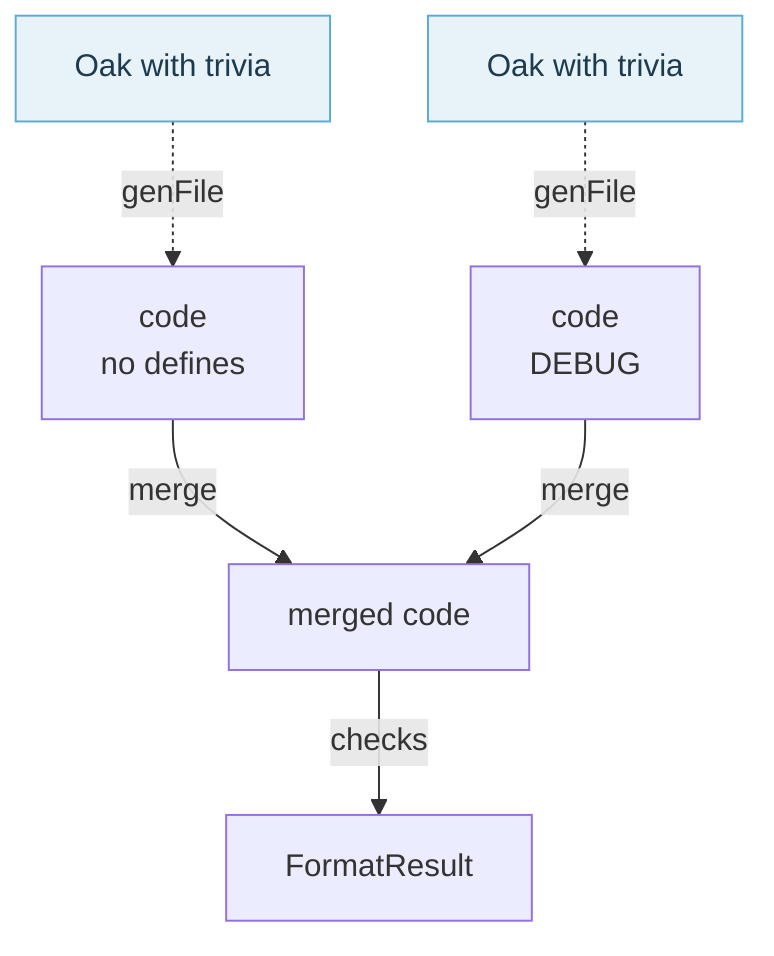

# Merging and checking

This page zooms in on the last two stages of [the formatting pipeline](./The%20Formatting%20Pipeline.html):
merging the code of every define combination into one, and checking that result.

## Merging the define combinations

When the source has conditional directives, every define combination was formatted on its own. The
results are merged back into one on their text: each is cut into fragments at its `#if`, `#elif`,
`#else` and `#endif` lines, and at every position the fragment with the most lines wins, an empty
branch losing to one with code. Every result therefore has to have the same number of fragments. See
`MultipleDefineCombinations.fs`, and [Multiple times](./Multiple%20Times.html) for when that fails.

## Checking the result

The merged code is checked for what the caller asked, through the `Validations` flags. Each check
reports its own kind of `ValidationIssue` in `FormatResult.Issues`, and no check changes what another
finds:

- `CommentSearch` looks for the text of every comment of the source in the merged code, in source
  order, without parsing it.
- `Parse` parses the merged code under each of its define combinations.
- `TriviaComparison` takes the merged code through the same stages as the source, parse, `mkOak` and
  `enrichTree`, and compares its `RecordedTrivia` with the source's, per define combination.
- `Idempotency` formats the merged code again and compares, when it has no parse errors: formatting
  it again would only fail on them.

The checks that read the merged code share their work: it is parsed once per define combination,
whichever of them need it. `Idempotency` parses it again, as formatting does. No check runs when the result is the source apart from trailing whitespace.

A result with issues is a bug in Fantomas. The command line tool and the daemon ask for
`CommentSearch` and `Parse`, and refuse a result that fails them. `fantomas doctor` and the
snapshot tests ask for all four, and `fantomas doctor` lists what was found.

<fantomas-nav source="{{fsdocs-source-filename}}" previous="{{fsdocs-previous-page-link}}" next="{{fsdocs-next-page-link}}"></fantomas-nav>
