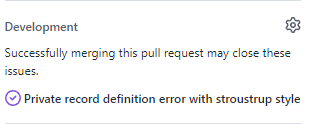

---
category: Contributors
categoryindex: 2
index: 11
---
# Pull request ground rules

We expect some things from code changes.
In general, changes should be made as consistent to the current code base as possible.
Don't introduce unnecessary new concepts and try and change as little code as possible to achieve your goal.

Always start with the mindset that you are going to introduce a change that might have an impact on how the tool behaves.
Capture this change first in a unit test. Set your expectations in the assert part of the test before touching anything.
This project is very well suited for [Test-driven development](https://en.wikipedia.org/wiki/Test-driven_development) and that should be the goal.

Typical unit test template:

```fsharp
[<Test>]
let ``my new test`` () =
    formatSourceString false """
let myInput =     42
"""  config
    |> prepend newline
    |> should equal """
let myInput = 42
"""
```

The vast majority of the tests use the template listed above. Only deviate from this when necessary.
Try and find a suitable file in `Fantomas.Core.Tests`, or introduce a new file.

A new test file should look like:

```fsharp
module Fantomas.Core.Tests.MyNewConceptTests

open NUnit.Framework
open FsUnit
open Fantomas.Core.Tests.TestHelper

// add tests here...
```

Filename: `MyNewConceptTests.fs`.

When developing a new feature, add new tests to cover all code paths.

If you come across an issue, which can't be reproduced with the latest version of Fantomas but is still open, please submit a regression test.
That way, we can ensure the issue stays fixed after closing it.

## Guidelines

### Target branch

Please always rebase your code on the targeted branch.
To keep your fork up to date, run this command:
> git remote add upstream https://github.com/fsprojects/fantomas.git

Updating your fork:

> git checkout main && git fetch upstream && git rebase upstream/main && git push

### Unit test

- Unit test names should start with a lowercase letter.
- When creating a test that is linked to a GitHub issue, add the number at the back with a comma, as in the following:

```fsharp
[<Test>]
let ``preserve compile directive between piped functions, 512`` () = ...
```
You don't need to repeat this number for tests that are deviations from the original report problem. 

### Verify signature files

Verify if the change you are making should also apply to signature files (`*.fsi`).

### Verify slight variations

- Check if you need additional tests to cope with a different combination of settings.
- Check if you need additional tests to cope with a different combination of defines (`#if DEBUG`, ...).

### Documentation

Write/update documentation when necessary.  
You can find instructions on how to run the documentation locally in the [docs/.README.md](https://github.com/fsprojects/fantomas/blob/main/docs/.README.md) file.

### Pull request title

- Give your PR a meaningful title. Make sure it covers the change you are introducing in Fantomas.

  For example:
  *"Fix bug 1404"* is a poor title as it does not tell the maintainers what changed in the codebase.  
  *"Don't double unindent when record has an access modifier"* is better as it informs us what exactly has changed.
- Add a link to the issue you are solving by using [a keyword](https://docs.github.com/en/github/managing-your-work-on-github/linking-a-pull-request-to-an-issue#linking-a-pull-request-to-an-issue-using-a-keyword) in the PR description.  
  *"Fixes #1404"* does the trick quite well. GitHub will automatically close the issue if you used the correct wording.

  

  Please verify your issue is linked. ([GitHub documentation](https://docs.github.com/en/github/managing-your-work-on-github/linking-a-pull-request-to-an-issue#linking-a-pull-request-to-an-issue-using-a-keyword))

- Not mandatory, but when fixing a bug consider using `fix-<issue-number>` as the git branch name.  
  For example, `git checkout -b fix-1404`.

### Format your changes

- Code should be formatted to our standard style, using either `dotnet fsi build.fsx -p FormatAll` which works on all files, or
  `dotnet fsi build.fsx -p FormatChanged` to just change the files in git.
    - If you forget, there's a git `pre-commit` script that will run this for you, make sure to run `dotnet fsi build.fsx -p EnsureRepoConfig` to set that hook up.

### Changelog

- Add an entry to the `CHANGELOG.md` in the `Unreleased` section based on what kind of change your change is. Follow the guidelines at [KeepAChangelog](https://keepachangelog.com/en/1.0.0/#how) to make your message relevant to future readers.
    - If you're not sure what Changelog section your change belongs to, start with `Changed` and ask for clarification in your Pull Request
    - If there's not an `Unreleased` section in the `CHANGELOG.md`, create one at the top above the most recent version like so:

      ```markdown
      ## [Unreleased]
  
      ### Changed
      * Your new feature goes here
  
      ## [4.7.4] - 2022-02-10
  
      ### Added
      * Awesome feature number one
      ```

    - When fixing a `bug (soundness)`, add a line in the following format to `Fixed`:
      `* <Original GitHub issue title> [#issue-number](https://github.com/fsprojects/fantomas/issues/issue-number)`.
      For example, `* Spaces are lost in multi range expression. [#2071](https://github.com/fsprojects/fantomas/issues/2071)`.
      Do the same, if you fixed a `bug (stylistic)` that is not related to any style guide.
    - When fixing a `bug (stylistic)`, add a line in the following format to `Changed`
      `Update style of xyz. [#issue-number](https://github.com/fsprojects/fantomas/issues/issue-number)`
    - For example, `* Update style of lambda argument. [#1871](https://github.com/fsprojects/fantomas/issues/1871)`.

### Run a local build

Finally, make sure to run `dotnet fsi build.fsx`. Among other things, this will check the format of the code and will tell you, if
your changes caused any tests to fail.

### Small steps

It is better to create a draft pull request with some initial small changes, and engage conversation, than to spend a lot of effort on a large pull request that was never discussed.
Someone might be able to warn you in advance that your change will have wide implications for the rest of Fantomas, or might be able to point you in the right direction.
However, this can only happen if you discuss your proposed changes early and often.
It's often better to check *before* contributing that you're setting off on the right path.

## Fixing style guide inconsistencies

Fantomas tries to keep up with the style guides, but as these are living documents, it can occur that something is listed in the style that Fantomas is not respecting.
In this case, please create an issue using our [online tool](https://fsprojects.github.io/fantomas-tools/#/).
Copy the code snippet from the guide and add a link to the section of the guide that is not being respected.
The maintainers will then add the `bug (stylistic)` to confirm the bug is fixable in Fantomas. In most cases, it may seem obvious that the case can be fixed.
However, in the past there have been changes to the style guide that Fantomas could not implement for technical reasons: Fantomas can only implement rules based on information entirely contained within the untyped syntax tree.

### Target the next minor or major branch

When fixing a stylistic issue, please ask the maintainers what branch should be targeted. The rule of thumb is that the `main` branch is used for fixing `bug (soundness)` and will be used for revision releases.
Strive to ensure that end users can always update to the latest patch revision of their current minor or major without fear.

A user should only need to deal with style changes when they have explicitly [chosen to upgrade](https://github.com/fsprojects/fantomas/blob/main/docs/Documentation.md#updating-to-a-new-fantomas-version) to a new minor or major version.
In case no major or minor branch was created yet, please reach out to the maintainers.
The maintainers will frequently rebase this branch on top of the main branch and release alpha/beta packages accordingly.

<fantomas-nav previous="./The%20Missing%20Comment.html"></fantomas-nav>
