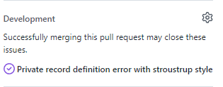

---
category: Contributors
categoryindex: 2
index: 15
---
# Pull request ground rules

We expect some things from code changes.
In general, changes should be made as consistent to the current code base as possible.
Don't introduce unnecessary new concepts and try and change as little code as possible to achieve your goal.

Always start with the mindset that you are going to introduce a change that might have an impact on how the tool behaves.
Capture this change first in a test. Set your expectations before touching anything.
This project is very well suited for [Test-driven development](https://en.wikipedia.org/wiki/Test-driven_development) and that should be the goal.

A formatting test is a snapshot case: a file in `src/Fantomas.Core.SnapshotTests/cases/` with the input, and its settings, if any, in a comment on top:

```fsharp
(*---
fsharp_space_before_colon = true
---*)
let myInput:int =     42
```

Beside it, `name.gold.fs` holds what formatting gives:

```fsharp
let myInput : int = 42
```

Put the case in the folder of the node it is about, or of the setting it shows, and start its name with the issue number when there is one, as in this example path: `cases/oak/Expr/Chain/trivia/2844-directive-in-parenthesis-argument.fs`. A case about comments, blank lines or directives goes in the `trivia/` folder of its node.
Let the test write its gold, and read it: it is what your change pins down.

```shell
FANTOMAS_UPDATE_SNAPSHOTS=1 dotnet test src/Fantomas.Core.SnapshotTests --filter "Name~2844-directive-in-parenthesis-argument"
```

The [snapshot tests' README](https://github.com/fsprojects/fantomas/blob/main/src/Fantomas.Core.SnapshotTests/README.md) has the rest: where a case goes, what every case checks, how to keep an input formatting must leave alone, and how to write the case for a bug that is not fixed yet.
`Fantomas.Core.Tests` is for what a case cannot show: unit tests of internals.

When developing a new feature, add new tests to cover all code paths.

If you come across an issue, which can't be reproduced with the latest version of Fantomas but is still open, please submit a regression test.
That way, we can ensure the issue stays fixed after closing it.

## Guidelines

### Target branch

Please always rebase your code on the targeted branch.
To keep your fork up to date, run this command:
> git remote add upstream https://github.com/fsprojects/fantomas.git

Updating your fork:

> git checkout main && git fetch upstream && git rebase upstream/main && git push

### Test names

- A case is named in lower case words joined by dashes. When it is linked to a GitHub issue, the number comes first, as in `1073-comment-after-closing-list-bracket.fs`. The tests check this.
- You don't need to repeat this number for cases that are deviations from the original report problem.
- A unit test name in `Fantomas.Core.Tests` starts with a lowercase letter.

### Verify signature files

Verify if the change you are making should also apply to signature files (`*.fsi`).

### Verify slight variations

- Check if you need additional tests to cope with a different combination of settings.
- Check if you need additional tests to cope with a different combination of defines (`#if DEBUG`, ...).

### Changing the Oak

The public types in `SyntaxOak.fs` may change in any release, a patch release included.
Add, remove or reorder the constructor parameters and members of a node whenever a fix needs it, and do not keep an old overload around for compatibility.
The Oak is versioned for formatting alone: code generation built on it is told to expect breaking changes, see [Updates](../end-users/GeneratingCode.html#Updates) in Generating source code.
Leave Oak changes out of the [upgrade guide](../end-users/UpgradeGuide.html#The-Oak): it shows how to compare `SyntaxOak.fs` between two releases instead.

### Documentation

Write/update documentation when necessary.  
You can find instructions on how to run the documentation locally in the [docs/.README.md](https://github.com/fsprojects/fantomas/blob/main/docs/.README.md) file.

### Pull request title

- Give your PR a meaningful title. Make sure it covers the change you are introducing in Fantomas.

  For example:
  *"Fix bug 1404"* is a poor title as it does not tell the maintainers what changed in the codebase.  
  *"Don't double unindent when record has an access modifier"* is better as it informs us what exactly has changed.
- Add a link to the issue you are solving by using [a keyword](https://docs.github.com/en/github/managing-your-work-on-github/linking-a-pull-request-to-an-issue#linking-a-pull-request-to-an-issue-using-a-keyword) in the PR description.  
  *"Fixes #1404"* does the trick quite well. GitHub will automatically close the issue if you used the correct wording.

  

  Please verify your issue is linked. ([GitHub documentation](https://docs.github.com/en/github/managing-your-work-on-github/linking-a-pull-request-to-an-issue#linking-a-pull-request-to-an-issue-using-a-keyword))

- Not mandatory, but when fixing a bug consider using `fix-<issue-number>` as the git branch name.  
  For example, `git checkout -b fix-1404`.

### Format your changes

- Code should be formatted to our standard style, using either `dotnet fsi build.fsx -p FormatAll` which works on all files, or
  `dotnet fsi build.fsx -p FormatChanged` to just change the files in git.
    - If you forget, there's a git `pre-commit` script that will run this for you, make sure to run `dotnet fsi build.fsx -p EnsureRepoConfig` to set that hook up.

### Changelog

- Add an entry to the `CHANGELOG.md` in the `Unreleased` section based on what kind of change your change is. Follow the guidelines at [KeepAChangelog](https://keepachangelog.com/en/1.0.0/#how) to make your message relevant to future readers.
    - If you're not sure what Changelog section your change belongs to, start with `Changed` and ask for clarification in your Pull Request
    - If there's not an `Unreleased` section in the `CHANGELOG.md`, create one at the top above the most recent version like so:

      ```markdown
      ## [Unreleased]
  
      ### Changed
      * Your new feature goes here
  
      ## [4.7.4] - 2022-02-10
  
      ### Added
      * Awesome feature number one
      ```

    - When fixing a `bug (soundness)`, add a line in the following format to `Fixed`:
      `* <Original GitHub issue title> [#issue-number](https://github.com/fsprojects/fantomas/issues/issue-number)`.
      For example, `* Spaces are lost in multi range expression. [#2071](https://github.com/fsprojects/fantomas/issues/2071)`.
      Do the same, if you fixed a `bug (stylistic)` that is not related to any style guide.
    - When fixing a `bug (stylistic)`, add a line in the following format to `Changed`
      `Update style of xyz. [#issue-number](https://github.com/fsprojects/fantomas/issues/issue-number)`
    - For example, `* Update style of lambda argument. [#1871](https://github.com/fsprojects/fantomas/issues/1871)`.

### Run a local build

Finally, make sure to run `dotnet fsi build.fsx`. Among other things, this will check the format of the code and will tell you, if
your changes caused any tests to fail.

### Small steps

It is better to create a draft pull request with some initial small changes, and engage conversation, than to spend a lot of effort on a large pull request that was never discussed.
Someone might be able to warn you in advance that your change will have wide implications for the rest of Fantomas, or might be able to point you in the right direction.
However, this can only happen if you discuss your proposed changes early and often.
It's often better to check *before* contributing that you're setting off on the right path.

## Coding conventions

For consistency sake we have a few coding conventions. Please respect those to keep everything as streamlined as possible.

### Member declaration

- Use `x` as the the `self-identifier` if you need it.

```fsharp
type Foo() =
    member _.Children = []
    
    // ✔️ OK
    member x.Length = x.Children.Length
    
    // ❌ Not preferred, we use `x`
    member this.WrongLength = this.Children.Length - 1
```

- Use `_` when you don't need the `self-identifier`.
- Use `member val` when possible.

```fsharp
type Foo(v: Value) =
    // ✔️ OK
    member val Value = v
    
        // ❌ Not preferred.
    member _.WrongValue = v
```

## Fixing style guide inconsistencies

Fantomas tries to keep up with the style guides, but as these are living documents, it can occur that something is listed in the style that Fantomas is not respecting.
In this case, please create an issue using our [online tool](https://fsprojects.github.io/fantomas-tools/#/).
Copy the code snippet from the guide and add a link to the section of the guide that is not being respected.
The maintainers will then add the `bug (stylistic)` to confirm the bug is fixable in Fantomas. In most cases, it may seem obvious that the case can be fixed.
However, in the past there have been changes to the style guide that Fantomas could not implement for technical reasons: Fantomas can only implement rules based on information entirely contained within the untyped syntax tree.

### Target the next minor or major branch

When fixing a stylistic issue, please ask the maintainers what branch should be targeted. The rule of thumb is that the `main` branch is used for fixing `bug (soundness)` and will be used for revision releases.
Strive to ensure that end users can always update to the latest patch revision of their current minor or major without fear.

A user should only need to deal with style changes when they have explicitly [chosen to upgrade](https://github.com/fsprojects/fantomas/blob/main/docs/Documentation.md#updating-to-a-new-fantomas-version) to a new minor or major version.
In case no major or minor branch was created yet, please reach out to the maintainers.
The maintainers will frequently rebase this branch on top of the main branch and release alpha/beta packages accordingly.

<fantomas-nav source="{{fsdocs-source-filename}}" previous="{{fsdocs-previous-page-link}}" next="{{fsdocs-next-page-link}}"></fantomas-nav>
