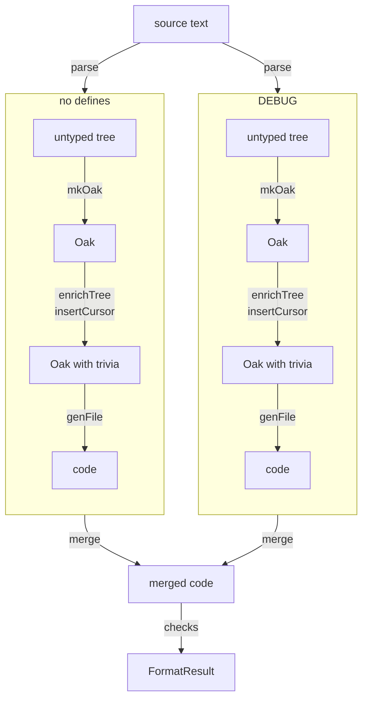

# The formatting pipeline

Everything `Fantomas.Core` does to a file happens in one pipeline: `CodeFormatterImpl.formatDocument`.
`CodeFormatter.FormatDocumentAsync` and `FormatDocumentWithValidationsAsync`, the public API that the
command line tool, the daemon and editors call, hand their arguments to it and return what it returns. Once you know its stages, you know where
any piece of `Fantomas.Core` fits.

Each box is what the pipeline holds at that point, and each arrow is what turns one into the next.
The source drawn here has one `#if DEBUG`, so it has two define combinations: none, and `DEBUG`.
Each combination goes from its untyped tree to its code on its own, in parallel with the others,
and the merge brings them back together.

## The stages

| Stage | Where | In → out | More |
|---|---|---|---|
| Read the source | `CodeFormatterImpl.getSourceText` | `string` → `ISourceText` | |
| Parse | `CodeFormatterImpl.parse` | `ISourceText` → `ParsedInput` per define combination | [Parsing and the Oak](./Transforming.html), [Conditional compilation directives](./Conditional%20Compilation%20Directives.html) |
| Build the Oak | `ASTTransformer.mkOak` | `ParsedInput` → `Oak` | [Parsing and the Oak](./Transforming.html) |
| Attach trivia | `Trivia.enrichTree` | `Oak` → `Oak` × `RecordedTrivia` | [Trivia](./Trivia%20Assignment.html), [The missing comment](./The%20Missing%20Comment.html) |
| Place the cursor | `Trivia.insertCursor` | `Oak` → `Oak` | [Trivia](./Trivia%20Assignment.html) |
| Print | `CodePrinter.genFile`, `Context.dump` | `Oak` → code | [Printing](./Traverse.html), [EventList](./EventList%20Architecture.html) |
| Merge | `MultipleDefineCombinations.mergeMultipleFormatResults` | code per combination → merged code | [Merging and checking](./Formatted%20Code.html), [Multiple times](./Multiple%20Times.html) |
| Check | private to `CodeFormatterImpl` | merged code → issues | [Merging and checking](./Formatted%20Code.html) |

**Parse.** The source is parsed once without defines, to find its conditional directives, and then
once for every combination of the defines they use. A source without `#if` has one combination, the
one without defines. When a parse has errors, nothing is formatted: `ParseException`, or
`DefineParseException` naming the combinations that failed.

**Attach trivia.** The untyped tree has no place for comments, blank lines and directives, so
`enrichTree` reads the comments and directives the parser recorded, `RecordedTrivia`, and attaches
each to the node it belongs with. It returns that `RecordedTrivia` next to the tree, because the
checks compare the result with it later.

**Each combination on its own.** The trees of the combinations are built, enriched and printed in
parallel. What carries on to the merge is each tree's code and its `RecordedTrivia`. The Oak does not:
it is gone as soon as its tree is printed. Whatever belongs to one combination travels as an
`UnderDefines<'T>`, the combination next to the value: the tree `parse` returns, and the code and
`RecordedTrivia` of each tree.

**Check.** The merged code is checked for what `validations` asks: whether every comment of the
source is still in it, whether it is valid F#, whether its comments and directives are those of the
source, and whether formatting it again changes it. Each finding is a `ValidationIssue` in
`FormatResult.Issues`. [Merging and checking](./Formatted%20Code.html) has what each check does.

## Looking inside from a test

A test calls `formatDocument` and asserts on the `FormatResult` it returns, or passes an `inspect`
hook. The hook is handed every tree right after it is printed, as an `UnderDefines<FormattedTree>`:
its defines, and its Oak, `RecordedTrivia` and code. The trees of the combinations are printed in
parallel, so the hook can be called for two at once. `Idempotency` formats the result again, and those
trees reach the hook too, marked with `SecondPass`.

The snapshot tests use the hook to check that every node's children are in source order and that
every comment and directive the parser recorded is attached to a node. They also collect each
combination's code and Oak from it for the per-define golds.

When a test needs to see more, give the hook or the result more to carry. Exporting another function
from a `.fsi` for a test splits the pipeline into pieces nothing else uses, and every `.fsi` should tell
this story: a function you cannot place on the diagram above is worth a second look.

<fantomas-nav source="{{fsdocs-source-filename}}" previous="{{fsdocs-previous-page-link}}" next="{{fsdocs-next-page-link}}"></fantomas-nav>
