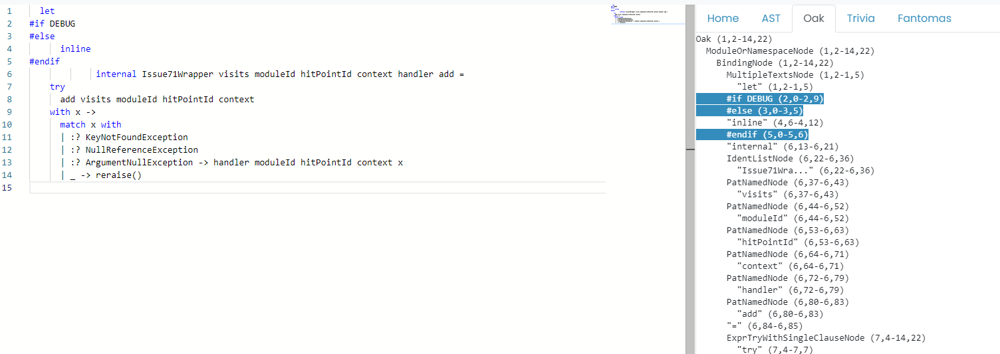
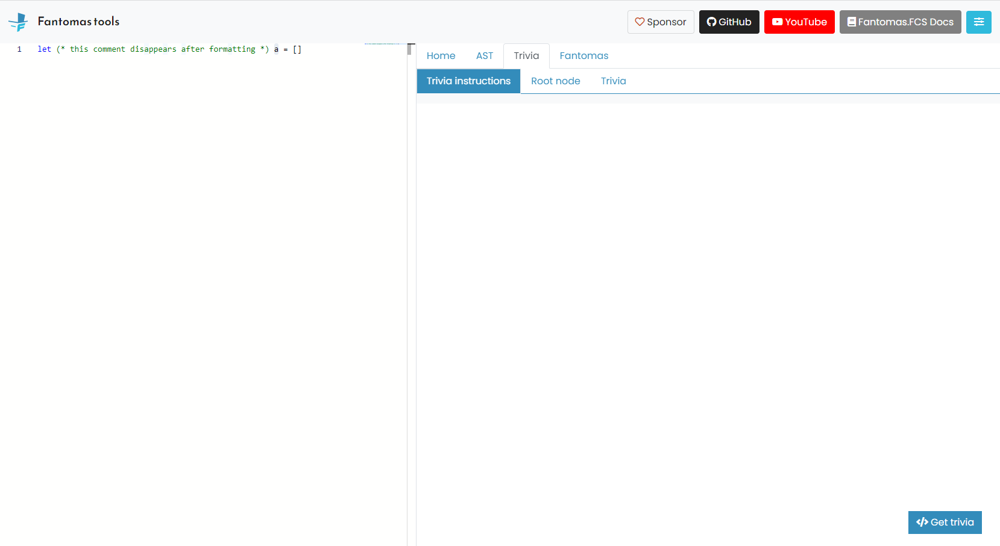

---
category: Contributors
categoryindex: 2
index: 10
---
# The Missing Comment

Code comment can literally exist between every single F# token. I'm looking at you block comment `(* ... *)`.  
As explained in [Detecting trivia](./Prepare%20Context.html#Detecting-trivia), we need to do quite some processing to restore code comments.  
In this guide, we would like to give you seven tips to restore a missing comment!

## Breathe

We very much understanding that losing a code comment after formatting can be extremely frustrating.  
There is no easy fix that will solve all the missing comments overnight. Each case is very individual and can be complex to solve.  
May these steps help towards fixing your problem!

## Isolate the problem

Before we can commence our murder mystery, it is best to narrow down our problem space.

Example ([#2490](https://github.com/fsprojects/fantomas/issues/2490)):

```fsharp
let (* this comment disappears after formatting *) a = []

type A = 
    {
        X : int
        ...
    }

while true do ()
```

Using the [online tool](https://fsprojects.github.io/fantomas-tools/#/fantomas/preview), we can remove any code that isn't relevant.
The `type` and `while` code can be trimmed and the problem still exists.

## Check the syntax tree

Every code comment should be present on the root level of the syntax tree.
[ParsedImplFileInputTrivia](../../reference/fsharp-compiler-syntaxtrivia-parsedimplfileinputtrivia.html) or [ParsedSigFileInputTrivia](../../reference/fsharp-compiler-syntaxtrivia-parsedsigfileinputtrivia.html) should contain the comment.

```fsharp
ImplFile
  (ParsedImplFileInput
     ("tmp.fsx", true, QualifiedNameOfFile Tmp$fsx, [], [],
      [ ... ], (false, false),
      { ConditionalDirectives = []
        CodeComments = [BlockComment tmp.fsx (1,4--1,50)] }))
```

If the comment is not there this means the F# lexer and parser didn't pick up the comment. In the  unlikely event this happened, this should be fixed first over at [dotnet/fsharp](https://github.com/dotnet/fsharp).

## Was the comment detected as trivia?

Fantomas grabs the comments straight from the syntax tree, and transforms them as `Trivia`.  
This is a fairly straightforward process, and you can easily visually inspect this using the [online tool](https://fsprojects.github.io/fantomas-tools/#/trivia).


If your comment does not show up there, it means there is a problem between getting the information from the syntax tree and constructing the `Trivia` in `Trivia.fs`.

## Was the trivia assigned to a trivia node?

The `Trivia` needs to be assigned to `TriviaNode` to be stored in the `Context`.  
Using the center tab in the tool, we can see the tree structure of all available `TriviaNodes`.



Choosing the best suitable node can be quite tricky, there are different strategies for different `TriviaTypes`.  
In this example `SynBindingKind_Normal` and `SynPat_Named` are good candidates as they appear right after the comment.  
Once the `Trivia` is assigned to a `TriviaNode`, a `TriviaInstruction` will be created. This is the link between them and is what will be stored in the `Context`.

The last tab in the tool show us the result of the assigment:



In this example, at the time of writing, there are no `TriviaInstructions`. This means the assignment in `Trivia.fs` failed and we would need to investigate why.

## Was the trivia assigned to the best possible node?

Sometimes the selected `TriviaNode` isn't really the best possible candidate.
In [#640](https://github.com/fsprojects/fantomas/issues/640), the `Directive` trivia are assigned to `SynBindingKind_Normal`.


Notice that `SynBindingKind_Normal` starts at line `6`, while the `Trivia` is wrapped around the `inline` keyword on line `4`.  
It would be ideal if we could use the `inline` keyword as `TriviaNode`, but looking at the tree, it doesn't appear to be present.
Why is that? Well, the syntax tree does, at the time of writing, not provide a `range` for the keyword.  
This would be a great addition as to [SyntaxTreeTrivia](../../reference/fsharp-compiler-syntaxtrivia.html), and can be done by submitting a pull request to [dotnet/fsharp](https://github.com/dotnet/fsharp).

## Printing the TriviaInstruction

The last piece of the puzzle is printing the actual `TriviaInstruction` in `CodePrinter`.
If the everything up to this point went well, and the comment is still missing after formatting, it means it was not printed.

Every `TriviaInstruction` has a type (`FsAstType`) and a `range`. The `range` is taking from an actual AST node, so when we encounter this `range` in `CodePrinter`, we need to act upon it.  
We typically do this by calling `genTriviaFor`, passing down the `type`, the `range` and a function `f` that should be compose in between.

Example:

```fsharp
genTriviaFor Ident_ (* : FsAstType *) ident.idRange (* range : *) genIdent (* : Context -> Context *) 
```

If we look at the definition of `genTriviaFor`:

```fsharp
and genTriviaFor (mainNodeName: FsAstType) (range: Range) f ctx =
    (enterNodeFor mainNodeName range +> f +> leaveNodeFor mainNodeName range) ctx
```

We can derive that composition will be as followed:

```fsharp
enterNodeFor Ident_ ident.idRange
+> genIdent
+> leaveNodeFor Ident_ ident.idRange
```

`enterNodeFor` and `leaveNodeFor` will print the `TriviaInstruction` it finds for the `range` and `type` inputs in the `Context`.

<fantomas-nav previous="./How%20Can%20I%20Contribute.html"></fantomas-nav>