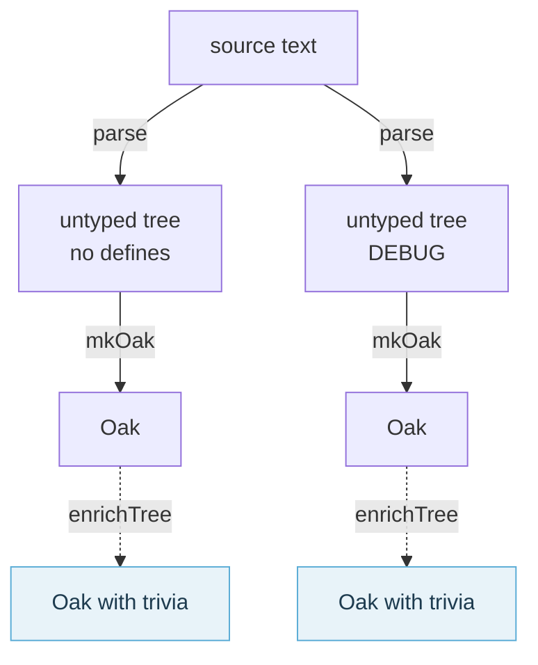

# Parsing and the Oak

This page zooms in on the first two stages of [the formatting pipeline](./The%20Formatting%20Pipeline.html):
parsing the source into an untyped tree per define combination, and turning each tree into an `Oak`.



## Parse

`CodeFormatterImpl.parse` uses the parser of the F# compiler, `parseFile` from `Fantomas.FCS`, and gets
back an untyped syntax tree and diagnostics.

`Fantomas.FCS` is not the [FSharp.Compiler.Service](https://www.nuget.org/packages/FSharp.Compiler.Service)
package. It is built from the sources of the F# compiler at a commit of our choosing, and only the files
the lexer and parser need. A parser improvement merged into [dotnet/fsharp](https://github.com/dotnet/fsharp)
is ours to use as soon as we move to a commit that has it, rather than at the next release of the
package, and nothing past the parser comes along. [History](./History.html#Creating-Fantomas-FCS-v5) has why it came to be, and
[Updating the compiler sources](./Updating%20the%20compiler.html) how to move it to a newer commit.

**Fantomas requires valid source code to format.**

If your code has errors, the parser cannot return a complete tree, and a complete tree is what every
stage after it needs.

```fsharp
let a =
```

This gives the parse error `Incomplete structured construct at or before this point in binding`, which
has `FSharpDiagnosticSeverity.Error`. Fantomas formats nothing that has one, and raises a
`ParseException` instead. Warnings do not stop it.

`parseFile` takes three parameters:

- `isSignature: bool`

The syntax tree of a signature file differs from that of an implementation file. The parser needs to
know which one it reads.

- `sourceText: ISourceText`

The input string is converted to an [ISourceText](https://fsprojects.github.io/fantomas/reference/fsharp-compiler-text-isourcetext.html) first, by `CodeFormatterImpl.getSourceText`.

- `defines: string list`

The defines a conditional directive tests change what the parser reads, and so the tree it returns.

```fsharp
let a =
    #if DEBUG
    0
    #else
    1
    #endif
```

With the defines `[]` the tree holds `1`, with `["DEBUG"]` it holds `0`: a tree only ever has one code
path. So the source is parsed once without defines, to find its directives, and then once for every
combination of the defines they test. A source without `#if` has one combination, the one without
defines. When one of the combinations has a parse error, a `DefineParseException` names them.
[Conditional compilation directives](./Conditional%20Compilation%20Directives.html) has how that plays
out.

`scripts/ast.fsx` prints the tree Fantomas parses. You can also ask your installed F# compiler:

```shell
# Tip: figure out the location of your installed sdk
whereis dotnet
# Invoke the parser
dotnet '/Users/nojaf/Library/Application Support/dnvm/dn/sdk/10.0.100/FSharp/fsc.dll' --parseonly --ast foo.fs
```

## Build the Oak

The untyped syntax tree from the F# compiler is used as an intermediate representation of source code in the process of transforming a text file to binary.  
The AST is optimized for the use-case of generating binary. What we try to do in Fantomas is stop at the first AST level and go back to source text.

The F# compiler was never designed with our use-case in mind and yet it has served us very well for years. 
In the past we did not have our own tree and were able to pull of formatting by traversing the compiler tree.
This of course had its limitations and we had to overcome these with some hacks.

Alas, some things in the AST aren't shaped the way we would like them to be. Sometimes, there is too much information, other times to little.
To stream line our entire process, we've decided to map the untyped tree to our own custom object model.
This introduces a lot of flexibility and simplifies our story.

> I thought Fangorn was dangerous - Gimli, son of Glóin

In `ASTTransformer.fs`, `mkOak` maps the AST to our tree model, the `Oak` in `SyntaxOak.fs`. Some of the benefits we get out of this:

- The Oak model does not differentiate between implementation files and signature files. We use one tree model which allows for optimal code re-use in `CodePrinter.fs`.
- We don't map all possible combinations of AST into our model. Sometimes valid AST code can in theory be created, 
  but will in practise never exist. For example [SynTypeDefnRepr.Exception](../../reference/fsharp-compiler-syntax-syntypedefnrepr.html#Exception). It is defined in `SyntaxTree.fs` yet the parser (`pars.fs`) will never create it.
  The F# compiler uses this later in the typed tree. We will throw an exception when encountering this during the mapping as we have the foresight of what the parser doesn't create.
- Recursive types are all considered as toplevel types. This is not the case in the AST but we map it as such.
- Some nodes are combined into one, for example a toplevel attribute will always be linked to its sibling do expression.
- The ranges of some nodes are being calculated when they lead to a more accurate result.
- Every `Node` can hold the trivia that belongs with it, which is where the next stage,
  [Trivia](./Trivia%20Assignment.html), puts the comments, blank lines and directives the tree has no
  place for.

`scripts/oak.fsx` prints the Oak of a file.

<fantomas-nav source="{{fsdocs-source-filename}}" previous="{{fsdocs-previous-page-link}}" next="{{fsdocs-next-page-link}}"></fantomas-nav>
