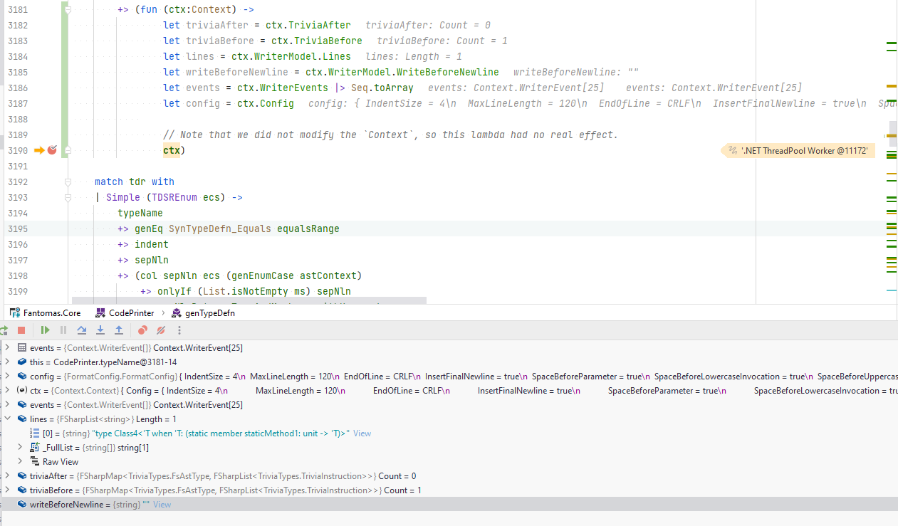

# Fantomas.Core overview (2)

Once the `Oak` is populated with all the found trivia, we can traverse the `Oak` to capture all the `WriterEvent`s.

<div class="mermaid text-center">
graph TD
    A[Transform source code to tree] --> B
    B[Traverse Oak to get formatted code] --> C[Formatted code]
    style B stroke:#338CBB,stroke-width:2px
 </div>

We enter the module of `CodePrinter` and try and reconstruct the code based on the given configuration.

## WriterEvents and WriterModel

In previous versions of Fantomas, `Context` had a [TextWriter](https://docs.microsoft.com/en-us/dotnet/api/system.io.textwriter?view=net-6.0) that was used to write the output.
This is a more advanced version of a `StringBuilder` and we wrote the formatted code directly to the buffer.

The key problem with this approach was that we couldn't easily revert code that was written to the buffer.  
For example, if the formatted code was crossing the `max_line_length`, we couldn't easily revert the code and try an alternative.

That is why we first capture a collection of `WriterEvent`s and then reconstruct the formatted code.  
If the code is too long, we can drop the last events and try an alternative.

### WriterModel

When we capture new events we also want to capture the current state of the result.  
This happens in the `WriterModel` record. There we store the result of each event as if it were finalized.  
By doing this, we can assert the result of the output. For example if our code is too long or not.

`WriterEvents` and `WriterModel` are very stable in the code base.  
When solving a bug, you typically need to change the collected series of events by using a different helper function inside `CodePrinter`.

### CodePrinter

In `CodePrinter` the syntax tree is being traversed with the help of various (partial) active patterns.  
These active patterns are defined in `SourceParser` and typically are used to present the information we are interested in, in a different shape.

`CodePrinter` exposes one function `genParsedInput`.

```fsharp
val genFile: oak: Oak -> (Context -> Context)
```

This takes an `Oak` and it returns a function that takes a `Context` and returns a new `Context`.

We will eventually call this function with an initial `Context`. This initial `Context` will have our default config.
In this function, all events are captured and stored in the `WriterEvents` and `WriterModel`.

While we are traversing the syntax tree, we will compose the `Context -> Context` function based on the content.
`Context.dump` then eventually takes the `Context` and returns a `string` of formatted code.

This may seem a bit complicated, but you typically can see this as an implementation detail and can abstract this when working in `CodePrinter`.

### Creating WriterEvents

There are various helper functions in `CodePrinter` that create `WriterEvent`s.  
In `CodePrinter` we will typically never construct a `WriterEvent` directly.

Instead we can use various helper functions that take the `Context` as parameter and return an updated `Context` with additional events.  
Please take a moment to debug the unit tests in [CodePrinterHelperFunctionsTests.fs](https://github.com/fsprojects/fantomas/blob/main/src/Fantomas.Core.Tests/CodePrinterHelperFunctionsTests.fs).  
This will give you a better understanding of how we capture events in `CodePrinter`.

### Debugging CodePrinter

One thing that is a bit harder to grasp initially, is what is happening when you put a breakpoint in `CodePrinter.fs`.  
In `CodePrinter.fs` we compose a format function that takes a `Context` and returns a `Context`.
We do this by traversing the syntax tree, and when you put a breakpoint in `genTypeDefn` for example:

<!-- TODO: update screenshot -->


we are still in the process of composing the format function.  
**The Context has not been going through our format function yet!**

If we want to debug when the `Context` is traveling through the format function, we can easily, temporarily, insert an additional function to inspect the `Context` content:



The `dumpAndContinue` helper function can be used to inspect the `Context`.  
Please remove all usages when submitting a PR 😸.


<fantomas-nav previous="{{fsdocs-previous-page-link}}" next="{{fsdocs-next-page-link}}"></fantomas-nav>
