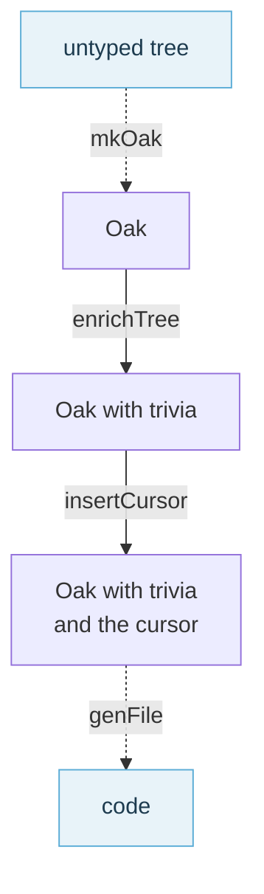

# Trivia

This page zooms in on the stage of [the formatting pipeline](./The%20Formatting%20Pipeline.html) that
gives each Oak its trivia: the comments, blank lines and directives the untyped tree has no place for.
`Trivia.enrichTree` attaches them to the nodes they belong with, and `Trivia.insertCursor` places the
cursor when there is one.



## Where trivia comes from

The untyped tree holds almost everything needed to print the code again, but not these:

- Blank lines
- Code comments
- Directives: `#if`, `#elif`, `#else` and `#endif`, and `#nowarn` and `#warnon`

Comments and directives are recorded by the parser, at the level of the file: in the `trivia` of
[ParsedImplFileInput](https://fsprojects.github.io/fantomas/reference/fsharp-compiler-syntax-parsedimplfileinput.html)
and [ParsedSigFileInput](https://fsprojects.github.io/fantomas/reference/fsharp-compiler-syntax-parsedsigfileinput.html).

```fsharp
let a = 
   // comment b
   c
```

roughly translates to

```fsharp
ImplFile
  (ParsedImplFileInput
     ("tmp.fsx", true, QualifiedNameOfFile Tmp$fsx, [], [],
      [SynModuleOrNamespace
         ([Tmp], false, AnonModule,
          [Let
             (false,
              [SynBinding(...)],
              tmp.fsx (1,0--3,4))], PreXmlDocEmpty, [], None, tmp.fsx (1,0--3,4),
          { ModuleKeyword = None
            NamespaceKeyword = None })], (false, false),
      { ConditionalDirectives = []
        CodeComments = [LineComment tmp.fsx (2,3--2,15)] }))
```

The tree records the line comment, but nothing links it to the let binding, so printing the binding
cannot restore it. Every piece of trivia has this problem. `enrichTree` reads what the parser
recorded, its `RecordedTrivia`, finds the blank lines by going over the lines of the
`ISourceText`, and attaches each to a node of the Oak: every `Node` has a `ContentBefore` and a
`ContentAfter`.

`enrichTree` returns that `RecordedTrivia` next to the tree. The checks compare the formatted
result with it, and the snapshot tests check that every comment and directive in it reached a node.

## How assignment works

`assignTriviaToTriviaInstruction` (Trivia.fs) receives a container node and a trivia item, then decides which child gets it as `ContentBefore` or `ContentAfter`.

It finds two candidates:
- **nodeAfter**: first child starting after the trivia's line
- **nodeBefore**: for indented single-line comments (column > 0), the deepest preceding node at the same column via `findNodeBeforeWithMatchingColumn`

### Decision rules

**1. Successor at different column: predecessor wins**

```fsharp
let x =
    try foo() with _ -> ()
    // comment here           (column 8)
let y = 1                     (column 4, different)
```

The comment matches the try-with at column 8. Since `let y` is at a different column, the comment becomes `ContentAfter` on the try-with.

**2. Same column, successor is a closing delimiter: predecessor wins**

```fsharp
let list = [
    someItem
    // comment
]
```

`]` is in the `closingDelimiters` set (`]`, `}`, `|}`, `)`, `|)`). The comment becomes `ContentAfter` on `someItem`.

**3. Same column, both are content: successor wins**

```fsharp
let a = 1
// comment
let b = 2
```

Both bindings are at column 0. The comment becomes `ContentBefore` on `let b`.

## Blank lines before comments

A blank line (`Newline` trivia at column 0) followed by an indented comment (`CommentOnSingleLine` at column > 0) would normally be assigned to different nodes, as the newline has no column info for matching.

`promoteNewlinesBeforeComments` pre-processes the trivia sequence: adjacent `Newline` items followed by a `CommentOnSingleLine` are combined into `CommentOnSingleLineWithLeadingNewlines(count, comment)`. This single trivia item uses the comment's range for assignment, keeping both on the same node.

The adjacency check ensures only consecutive newlines on adjacent lines are combined. Distant blank lines (separated by code) are flushed independently.

## The cursor

An editor can ask where its cursor ends up after formatting. `insertCursor` finds the node the cursor
lies in: a `SingleTextNode` holds it, anywhere else it is attached as trivia, like a comment would be.
The printer reports where it landed in `FormatResult.Cursor`.

## Debugging

### Oak tree with trivia markers

```bash
dotnet fsi scripts/oak.fsx <file>
```

The output uses arrows to show trivia placement:
- `▼` = `ContentBefore`
- `▲` = `ContentAfter`

Example:
```
ExprArrayOrListNode((1,11--4,1)
  SingleTextNode((1,11--1,12), "[")
  SingleTextNode((2,4--2,12), "someItem")
  ▲ CommentOnSingleLine(range: (3,4--3,14), "// comment")
  SingleTextNode((4,0--4,1), "]")
)
```

### Writer events

```bash
dotnet fsi scripts/writer-events.fsx [--editorconfig <settings>] <file>
```

Shows the sequence of `WriterEvent` values produced during formatting. Use `--editorconfig` to pass settings like `fsharp_multiline_bracket_style=stroustrup`.

### Per-define Oak

```bash
dotnet fsi scripts/oak.fsx --define SOMETHING <file>
```

Shows the Oak for a specific define combination, useful for debugging trivia assignment with `#if`/`#else`/`#endif` blocks.

## Known limitations

### Hash directive boundaries

`findNodeBeforeWithMatchingColumn` does not account for `#if`/`#else`/`#endif` directives between the candidate node and the comment. A comment after `#endif` at the same column as an item inside `#if` can be incorrectly assigned across the directive boundary.

```fsharp
// Input:
let list = [
    someItem
    #if something
    item1
    #else
    item2
    #endif
    // comment      <-- column 4, matches item1/item2 across directive boundary
]
```

With `something` defined, the Oak shows:
```
SingleTextNode "item1"
▲ CommentOnSingleLine "// comment"    <-- assigned to item1, skipping #else/#endif
▼ Directive "#else"
▼ Directive "#endif"
SingleTextNode "]"
```

The comment (line 8) is emitted before `#else` (line 5), reversing source order.

### Trailing trivia inflating width

Comments assigned as `ContentAfter` make the owning expression appear wider or multiline in speculative formatting checks. This can cause expressions that fit on one line to be forced into multiline layout:

```fsharp
// Input:
Html.a [ prop.className "navbar-item" ]
(* block comment *)

// After trivia reassignment, the comment is ContentAfter on Html.a [...].
// The speculative check sees the trivia events and decides it's "multiline":
Html.a [
    prop.className "navbar-item"
]
    (* block comment *)
```

The formatted output is valid and idempotent but more verbose than necessary.

<fantomas-nav source="{{fsdocs-source-filename}}" previous="{{fsdocs-previous-page-link}}" next="{{fsdocs-next-page-link}}"></fantomas-nav>
